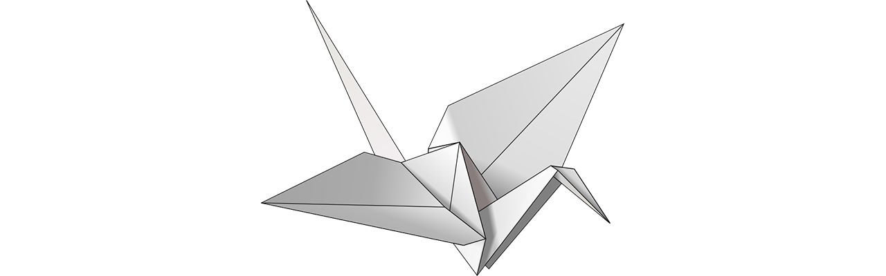
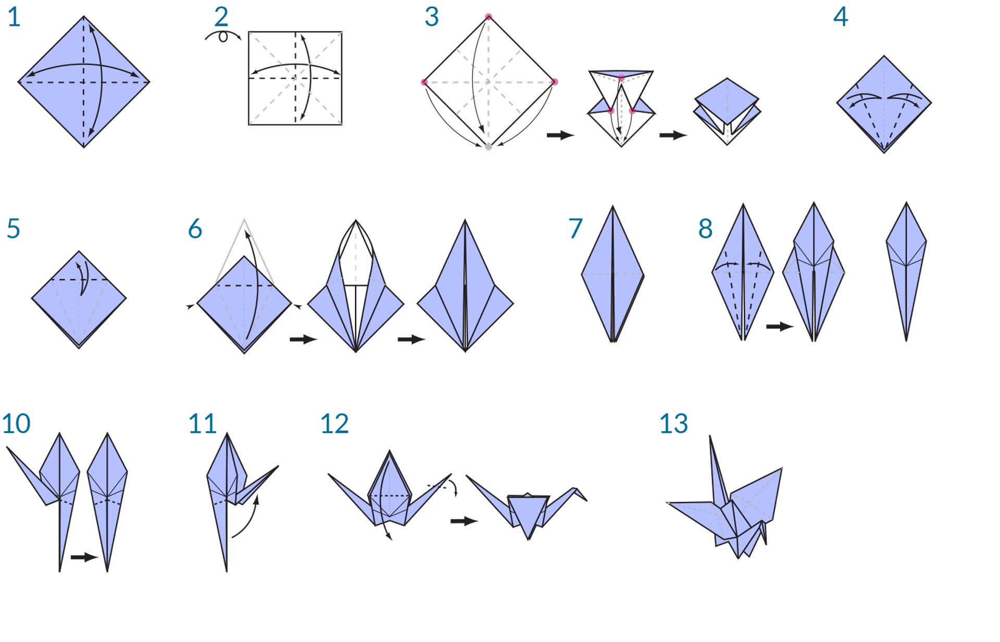

###What is Visual Programming?  可视化编程是什么?

Designing frequently involves establishing visual, systemic, or geometric relationships between the parts of a design. More times than not, these relationships are developed by workflows that gets us from concept to result by way of rules. Perhaps without knowing it, we are working algorithmically - defining a step-by-step set of actions that follow a basic logic of input, processing, and output. Programming allows us to continue to work this way but by formalizing our algorithms.

经常涉及到建立视觉设计、系统性或几何部分的设计之间的关系。很多情况下,这些关系是由工作流,让我们从概念到结果的规则。也许在不知情的情况下,我们正在通过算法——定义一套循序渐进的行为遵循一个基本逻辑的输入、处理和输出。编程允许我们继续这种方式而是通过形式化算法。


###Algorithms in Hand  算法的手
While offering some powerful opportunities, the term **Algorithm** can carry some misconceptions with it. Algorithms can generate unexpected, wild, or cool things, but they are not magic. In fact, they are pretty plain, in and of themselves. Let's use a tangible example like an origami crane. We start with a square piece of paper (input), follow a series of folding steps (processing actions), and result in a crane (output).

同时提供一些强大的机会,* * * *算法可以携带一些误解。算法可以产生意想不到的,野外,或者很酷的东西,但是他们不是魔法。事实上,他们很普通,和自己。让我们用一个实实在在的例子像一个纸鹤。我们从一个正方形的纸(输入),遵循一系列的折叠步骤(处理行动),并导致起重机(输出)。




So where is the Algorithm? It is the abstract set of steps, which we can represent in a couple of ways - either textually or graphically.

所以算法在哪里?它是抽象的步骤,我们可以在几个方面代表——文本或图形。


**Textual Instructions:**    文本说明  
1. Start with a square piece of
paper, coloured side up. Fold in half and open. Then fold in half the other way.
2. Turn the paper over to the white side. Fold the paper in half, crease well and open, and then fold again in the other direction.
3. Using the creases you have made, Bring the top 3 corners of the model down to the bottom corner. Flatten model.
4. Fold top triangular flaps into the center and unfold.
5. Fold top of model downwards, crease well and unfold.
6. Open the uppermost flap of the model, bringing it upwards and pressing the sides of the model inwards at the same time. Flatten down, creasing well.
7. Turn model over and repeat Steps 4-6 on the other side.
8. Fold top flaps into the center.
9. Repeat on other side.
10. Fold both ‘legs’ of model up, crease very well, then unfold.
11. Inside Reverse Fold the “legs” along the creases you just made.
12. Inside Reverse Fold one side to make a head, then fold down the wings.
13. You now have a crane.


1。从一块方形的开始
纸,彩色的一面。和开放的对折。然后折叠一半。
2。把论文交给白的一面。把纸对折,折痕和开放,然后叠在另一个方向。
3所示。使用的折痕,降低模型的前三角落底部角落。平模型。
4所示。折叠前三角皮瓣为中心和展开。
5。向下折叠的模型,折痕和展开。
6。打开的皮瓣模型,把它向上向内和紧迫的模型在同一时间。平,压痕。
7所示。把模型,重复步骤4 - 6在另一边。
8。折叠皮瓣为中心。
9。重复在另一边。
10。折叠的腿模型,折痕,然后展开。
11。内部反向折叠沿着折痕的“腿”了。
12。内部反向折叠一侧头,然后折了翅膀。
13。你现在有一个起重机。


**Graphical Instructions:**



###Programming Defined   编程定义
Using either of these sets of instructions should result in a crane, and if you followed along yourself, you've applied an algorithm. The only difference is the way in which we read the formalization of that set of instructions and that leads us to **Programming**. Programming, frequently shortened from *Computer Programming*, is the act of formalizing the processing of a series of actions into an executable program. If we turned the above instructions for a creating crane into a format our computer can read and execute, we are Programming.

使用这些设置的指令应该导致一个起重机,如果你沿着自己,你应用一个算法。唯一的区别是,我们读到的指令集的形式化,使我们* * * *编程。编程中,经常缩短计算机编程从* *,是形式化的行为的一系列行为的处理成一个可执行程序。如果我们把上面的指令创建起重机格式我们的电脑可以阅读并执行,我们编程。


The key to and first hurdle we will find in Programming, is that we have to rely on some form of abstraction to communicate effectively with our computer. That takes the form of any number of Programming Languages, such as Javascript, Python, or C. If we can write out a repeatable set of instructions, like for the origami crane, we only need to translate it for the computer. We are on our way to having the computer be able to make a crane or even a multitude of different cranes where each one varies slightly. This is the power of Programming - the computer will repeatedly execute whatever task, or set of tasks, we assign to it, without delay and without human error.


和第一的关键障碍我们会发现在程序设计中,是我们必须依靠某种形式的抽象有效沟通与我们的电脑。采用某种形式的任意数量的编程语言,如Javascript、Python或c。如果我们能写出一组可重复的指令,就像纸鹤,我们只需要把它翻译为计算机。我们是让计算机能够使起重机甚至多种不同的起重机,每一个稍有不同。这是编程的能力,计算机将重复执行任何任务,或一组任务,我们分配给它,及时,没有人为错误。


####Visual Programming Defined    可视化编程定义
>Download the example file that accompanies this exercise (Right click and "Save Link As..."): [Visual Programming - Circle Through Point.dyn](datasets/1-1/Visual Programming - Circle Through Point.dyn). A full list of example files can be found in the Appendix.


>下载附带的示例文件这个练习(右点击“链接另存为…”):[可视化编程,通过点圆。达因)(数据集/ 1 - 1 /可视化编程-通过Point.dyn圆)。示例文件的完整列表可以在附录中找到。


If you were tasked with writing instructions for folding an origami crane, how would you go about it? Would you make them with graphics, text, or some combination of the two?

如果你是负责编写说明折纸鹤,你怎么去呢?你会让他们与图形、文本、或两者的某种组合?


If your answer contained graphics, then **Visual Programming** is definitely for you. The process is essentially the same for both Programming and Visual Programming. They utilize the same framework of formalization; however, we define the instructions and relationships of our program through a graphical (or "Visual") user interface. Instead of typing text bound by syntax, we connect pre-packaged nodes together. Here's a comparison of the same algorithm - "draw a circle through a point" - programmed with nodes versus code:


如果你的回答包含图形,然后* *可视化编程* *绝对是给你的。这个过程本质上是相同的编程和可视化编程。他们使用相同的形式化框架;然而,我们定义我们的程序的指令和关系通过图形用户界面(或“视觉”)。而不是输入文本受语法,我们预包装的节点连接在一起。这是比较相同的算法——“画一个圆通过点”——与节点编程和代码:


**Visual Program:**    可视化程序


**Textual Program:**
```
myPoint = Point.ByCoordinates(0.0,0.0,0.0);
x = 5.6;
y = 11.5;
attractorPoint = Point.ByCoordinates(x,y,0.0);
dist = myPoint.DistanceTo(attractorPoint);
myCircle = Circle.ByCenterPointRadius(myPoint,dist);
```
The results of our algorithm:


The visual characteristic to programming in such a way lowers the barrier to entry and frequently speaks to designers. Dynamo falls in the Visual Programming paradigm, but as we will see later, we can still use textual programming in the application as well.


视觉特征到编程的方式降低了门槛,经常与设计师。发电机在视觉编程范式,但我们会看到之后,我们仍然可以在应用程序中使用文本编程。


