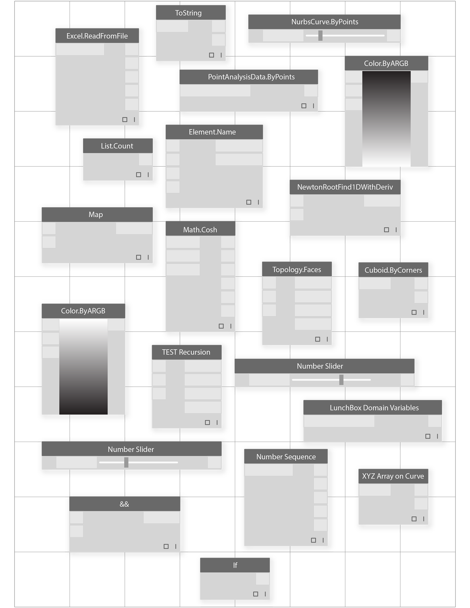

#THE BUILDING BLOCKS OF PROGRAMS

# 程序的构建块 

Once we are ready to dive deeper into developing Visual Programs, we will need a deeper understanding of the building blocks we will use. This chapter introduces fundamental concepts around data - the stuff that travels through the Wires of our Dynamo program.

一旦我们准备深入研究开发可视化程序,我们需要更深入地理解我们将使用的构建块。本章介绍数据-基本概念的东西穿过我们发电机的连接程序。

