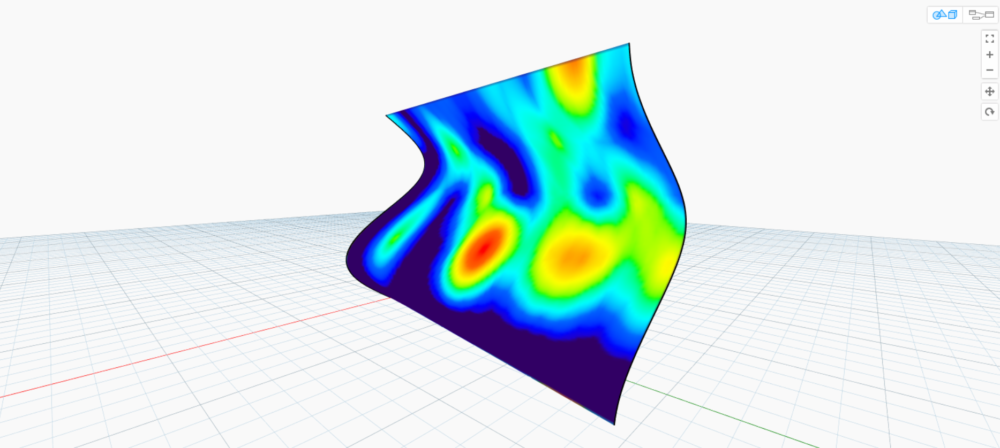

##Color   颜色
Color is a great data type for creating compelling visuals as well as for rendering difference in the output from your Visual Program. When working with abstract data and varying numbers, sometimes it's difficult to see what's changing and to what degree. This is a great application for colors.

颜色是一个很好的数据类型创建引人注目的视觉效果以及渲染可视化程序的输出的不同。使用抽象数据和不同的号码时,有时很难看到什么变化和到什么程度。这是一个很好的颜色申请。

 
###Creating Colors    创建颜色
Colors in Dynamo are created using ARGB inputs.This corresponds to the Alpha, Red, Green, and Blue channels. The alpha represents the *transparency* of the color, while the other three are used as primary colors to generate the whole spectrum of color in concert.

颜色在发电机使用ARGB创建输入。这对应于α,红、绿、蓝通道。α代表* *的颜色,透明度,另三个是用作原色生成整个光谱的颜色一致。

| Icon | Name | Syntax| Inputs | Outputs |
| -- | -- | -- | -- | -- | -- |-- |
|  | ARGB Color | Color.ByARGB | A,R,G,B | color |

###Querying Color Values    查询颜色值
The colors in the table below query the properties used to define the color: Alpha, Red, Green, and Blue.  Note that the Color.Components Node gives us all four as different outputs, which makes this Node preferable for querying the properties of a color.

下面的颜色表中查询属性用于定义颜色:α,红、绿、蓝。注意颜色。组件的节点给我们四个不同的输出,使得该节点的查询的属性的颜色。

| Icon | Name | Syntax| Inputs | Outputs |
| -- | -- | -- | -- | -- | -- | -- |
|  | Alpha | Color.Alpha | color | A |
|  | Red | Color.Red | color | R |
|  | Green | Color.Green | color | G |
|  | Blue | Color.Blue | color | B |
|  | Components | Color.Components | color | A,R,G,B |

The colors in the table below correspond to the **HSB color space**.  Dividing the color into hue, saturation, and brightness is arguably more intuitive for how we  interpret color: What color should it be? How colorful should it be? And how light or dark should the color be?  This is the breakdown of hue, saturation, and brightness respectively.

下表对应的颜色**HSB颜色空间 ** 把颜色分为色相、饱和度和亮度可以说是更直观的对我们如何解释颜色:应该是什么颜色的?色彩斑斓的应该是如何?和光明或黑暗的颜色应该如何?这是崩溃的色相、饱和度和亮度。

| Icon | Query Name | Syntax| Inputs | Outputs |
| -- | -- | -- | -- | -- | -- | -- |
|  | Hue | Color.Hue | color | Hue |
|  | Saturation | Color.Saturation | color | Saturation |
|  | Brightness | Color.Brightness | color | Brightness |

###Color Range   颜色范围
The color range is similar to the **Remap Range** Node from section 4.2: it remaps a list of numbers into another domain.  But instead of mapping to a *number* domain, it maps to a *color gradient* based on input numbers ranging from 0 to 1.

颜色范围是类似于* *重新映射范围从4.2节* *节点:它重新映射数据到另一个域的列表。而是*人数*域的映射,它映射到一个* *基于颜色梯度的输入数字从0到1。

The current Node works well, but it can be a little awkward to get everything working the first time around. The best way to become familiar with the color gradient is to test it out interactively. Let's do a quick exercise to review how to setup a gradient with output colors corresponding to numbers.

当前节点是有效的,但可能有点尴尬的把一切工作第一。熟悉的颜色梯度的最好办法是交互式地对其进行测试。让我们做一个快速的运动审查如何设置一个梯度与输出颜色对应的数字。

>1. **Define three colors: ** Using a code block node, define *red, green*, and *blue* by plugging in the appropriate combinations of *0* and *255*.
2. **Create list:** Merge the three colors into one list.
3. **Define Indices: ** Create a list to define the grip positions of each color (ranging from 0 to 1).  Notice the value of 0.75 for green.  This places the green color 3/4 of the way across the horizontal gradient in the color range slider.
4. **Code Block: ** Input values (between 0 and 1) to translate to colors.

> 1.**定义三种颜色**使用一个代码块节点,定义*红、蓝色绿色*,* *插入适当的组合的* *和* 255 * 0。
> 
> 2.**创建列表**合并三种颜色为一个列表。
> 
> 3.所示。**定义指数**创建一个列表来定义每一种颜色的手柄的位置(从0到1)。注意绿色的值为0.75。这个地方穿过 的绿色3/4水平梯度颜色滑块范围。
> 
> 4.所示**代码块**输入值(0和1之间)转化为颜色。
> 

### Color Preview   颜色预览
The **Display.ByGeometry** Node gives us the ability to color geometry in the Dynamo viewport.  This is helpful for separating different types of geometry, demonstrating a parametric concept, or defining an analysis legend for simulation.  The inputs are simple: geometry and color. To createa a gradient like the image above, the color input is connected to the **color range** Node.

**Display.ByGeometry **节点给我们颜色几何发电机视窗的能力。这是有利于分离不同类型的几何图形,展示一个参数的概念,或定义一个分析仿真的图例。输入很简单:几何形状和颜色。创建一个梯度像上图一样,颜色输入连接到** color range**

###Color Exercise   颜色练习
>Download the example file that accompanies this exercise (Right click and "Save Link As..."): [Building Blocks of Programs - Color.dyn](datasets/4-5/Building Blocks of Programs - Color.dyn). A full list of example files can be found in the Appendix.

>下载附带的示例文件这个练习(右点击“链接另存为…”):[构建模块的程序-颜色。达因)([Building Blocks of Programs - Color.dyn](datasets/4-5/Building Blocks of Programs - Color.dyn))。示例文件的完整列表可以在附录中找到。

This exercise focuses on controlling color parametrically in parallel with geometry. The geometry is a basic helix, which we define below using the **Code Block** (3.2.3). This is a quick and easy way to create a parametric function; and since our focus is on color (rather than geometry), we use the code block to efficiently create the helix without cluttering the canvas.  We will use the code block more frequently as the primer moves to more advanced material.

这个练习专注于控制颜色参数化和几何平行。几何是一个基本的螺旋,我们定义以下代码块使用* * * *(3.2.3)。这是一个快速和简单的方法来创建一个参数函数;因为我们的重点是颜色(而不是几何),我们使用代码块来有效地创建无需提供螺旋画布上。我们将更频繁地使用代码块作为引物移动到更先进的材料。

> 1. **Code Block:** Define the two code blocks with the formulas above.  This is a quick parametric method for creating a spiral.
2. **Point.ByCoordinates:**Plug the three outputs from the code block into the coordinates for the Node.

We now see an array of points creating a helix.  The next step is to create a curve through the poitns so that we can visualize the helix.

> 1**代码块**定义两个代码块与上面的公式。这是一个快速参数化方法创建一个螺旋。
> 
>  2**点。ByCoordinates:**的三个输出代码块插入节点的坐标。
>  

我们现在看到的点创建一个螺旋。下一步是创建一个曲线通过螺旋poitns这样我们可以想象。

> 1. **PolyCurve.ByPoints:** Connect the *Point.ByCoordinates* output into the *points* input for the Node.  We get a helical curve.
2. **Curve.PointAtParameter:** Connect the *PolyCurve.ByPoints* output into the *curve* input. The purpose of this step is to create a parametric attractor point which slides along the curve.  Since the curve is evaluating a point at parameter, we'll need to input a *param* value betwen 0 and 1.
3.  **Number Slider:** After adding to the canvas, change the *min* value to *0.0*, the *max* value to *1.0*, and the *step* value to *.01*.  Plug the slider output into the *param* input for *Curve.PointAtParameter*.  We now see a point along the length of the helix, represented by a percentage of the slider (0 at the start point, 1 at the end point).

> 1** PolyCurve。ByPoints:** *点连接。ByCoordinates * 输出到*分*输入节点。我们得到了一个螺旋形曲线。
> 2。**曲线。PointAtParameter:* ** PolyCurve连接。曲线ByPoints *输出到* *输入。这一步的目的是创建一个幻灯片沿着曲线参数吸引子点。由于曲线是评价一个点参数,我们需要输入参数值在0和1之间。
> 3所示。**滑块数量:**后添加到画布上,改变*分*值* 0.0 *,*马克斯•*值* 1.0 *和* * * . 01价值*步。滑块输出插入*参数* * Curve.PointAtParameter *输入。我们现在看到沿螺旋线的长度,表示为一个百分比的滑块(0起点,终点1)。

With the reference point created, we now compare the distance from the reference point to the original points defining the helix.  This distance value will drive geometry as well as color.

与参考点创建的,我们现在比较参考点到原始点的距离定义螺旋。这个距离值将驱动几何形状以及颜色。

> 1. **Geometry.DistanceTo:** Connect *Curve.PointAtParameter* output into the *input*.  Connect *Point.ByCoordinates* into the *geometry input.
2. **Watch:** The resultant output shows a list of distances from each helical point to the reference point along the curve.

> 1。**几何学。DistanceTo:** *曲线连接。PointAtParameter输出到输入* **。连接*点。ByCoordinates *到*几何输入。
> 2。**注意**结果输出显示距离的列表每个螺旋沿着曲线的参考点。

Our next step is to drive parameters with the list of distances from the helical points to the reference point.  We use these distance values to define the radii of a series of spheres along the curve. In order to keep the spheres a suitable size, we need to *remap* the values for distance.

我们的下一步是驱动参数列表的距离从螺旋点到参考点。我们用这些距离值来定义一系列球体的半径沿着曲线。为了保持球体的一个合适的尺寸,我们需要重新映射距离的值。

> 1. **Math.RemapRange:** Connect *Geometry.DistanceTo* output inot the numbers input.
2. **Code Block:** connect a code block with a value of *0.01* into the *newMin* input and a code block with a value of *1* into the *newMax* input.
3. **Watch:** connect the *Math.RemapRange* output into one Node and the *Geometry.DistanceTo* output into another.  Compare the results.

> 1.* *Math.RemapRange** *Geometry.DistanceTo *输出inot数字输入。
> 
> 2.* *代码块:* *连接一个代码块的值* 0.01 * * newMin *输入和一个代码块的价值* 1 * * newMax *输入。
> 
> 3所示。* *注意:* * *数学联系起来。RemapRange *输出到一个节点和*几何学。DistanceTo *输出到另一个。比较结果。
> 

This step has remapped the list of distance to be a smaller range.  We can edit the *newMin* and *newMax* values however we see fit.  The values will remap and will have the same *distribution ratio* across the domain.

这一步已经重新映射列表的距离是一个较小的范围内。我们可以编辑* newMin *和* newMax *值然而我们认为合适的。将重新映射,并将值具有相同的跨域*分配比*。

> 1. **Sphere.ByCenterPointRadius:** connect the *Math.RemapRange* output into the *radius* input and the original *Point.ByCoordinates* output into the *centerPoint* input.

> 1.**球体。ByCenterPointRadius:** *数学联系起来。RemapRange *输出到* *输入半径和原始*点。ByCoordinates *输出到*中心*输入。

> 1. **Number Slider:** change the value of the number slider and watch the size of the spheres update.  We now have a parametric jig.

> 1。**滑块数量**改变滑块数量和手表的价值大小的球体更新。我们现在有一个参数夹具。

The size of the spheres demonstrates the parametric array defined by a reference point along the curve.  Let's use the same concept for the sphere radius to drive their color.

球体的大小体现了参数数组定义为一个参考点沿曲线。让我们为球面半径使用相同的概念来驱动他们的颜色。

>  1. **Color Range:** Add top the canvas.  When hovering over the *value* input, we notice that the numbers requested are between 0 and 1.  We need to remap the numbers from the *Geometry.DistanceTo* output so that they are compatible with this domain.
 2. **Sphere.ByCenterPointRadius:** For the time being, let's disable the preview on this Node (*Right Click > Preview*)

>  1.**颜色范围**添加画布。悬停在* *输入值时,我们注意到请求的数量是在0和1之间。我们需要重新映射的数字几何。DistanceTo *输出,兼容这一领域。
2。* *球体。ByCenterPointRadius:* *,让我们关闭预览这个节点(*右键>预览*)

> 1. **Math.RemapRange:** This process should look familiar. Connect the *Geometry.DistanceTo* output into the numnbers input.
2. **Code Block:** Similar to an earlier step, create a value of *0* for the *newMin* input and a value of *1* for the *newMax* input.  Notice that we are able to define two outputs from one code block in this case.
3. **Color Range:** Connect the *Math.RemapRange* output into the *value* input.

> 1. **Math.RemapRange:** 这个过程看起来应该很熟悉. 连接 *Geometry.DistanceTo* 输出到numnbers输入.
2. **Code Block:** 类似于早先一步, 创造的价值 *0* 为 *newMin* 输入一个值 *1* 为 *newMax* 输入.  请注意,我们能够从一个代码块定义两个输出.
3. **Color Range:** 连接 *Math.RemapRange* 输出到 *value* 输入

> 1. **Color.ByARGB:** This is what we'll do to create two colors.  While this process may look awkward, it's the same as RGB colors in another software, we're just using visual programming to do it.
2. **Code Block:** create two values of *0* and *255*.  Plug the two outputs into the two *Color.ByARGB* inputs in agreement with the image above (or create your favorite two colors).
3. **Color Range:** The *colors* input requests a list of colors.  We need to create this list from the two colors created in the previous step.
4. **List.Create:** merge the two colors into one list.  Plug the output into the *colors* input for *Color Range*.

> 1. **Display.ByGeometryColor:** Connect *Sphere.ByCenterPointRadius* into the *geometry* input and the *Color Range* into the *color* input. We now have a smooth gradient across the domain of the curve.

> If we change the value of the *number slider* from earlier in the definition, the colors and sizes update.  Colors and radius size are directly related in this case: we now have a visual link between two parameters!

### Color On Surfaces
The **Display.BySurfaceColors** node gives us the ability to map data across a surface using color! This functionality introduces some exciting possibilities for visualizing data obtained through discrete analysis like solar, energy, and proximity. Applying color to a surface in Dynamo is similar to applying a texture to a material in other CAD environments. Let's demonstrate how to use this tool in the brief exercise below.

###Color on Surfaces Exercise
>Download the example file that accompanies this exercise (Right click and "Save Link As..."): [Building Blocks of Programs - ColorOnSurface.zip](datasets/4-5/BuildingBlocks of Programs - ColorOnSurface.zip). A full list of example files can be found in the Appendix.

> First, we need to create (or reference) a surface to use as an input for the **Display.BySurfaceColors** node. For this example we are lofting between a sine and cosine curve.
1. This **Group** of nodes is creating points along the Z-axis then displacing them based on sine and cosine functions. The two point lists are then used to generate NURBS curves.
2. **Surface.ByLoft**: generate an interpolated surface between the list of NURBS curves.

>1. **File Path**: select an image file to sample for pixel data downstream
2. use **File.FromPath** to convert the file path to a file then pass into **Image.ReadFromFile** to output an image for sampling
3. **Image.Pixels**: input an image and provide a sample value to use along the x and y dimensions of the image.
4. **Slider**: provide sample values for **Image.Pixels**
5. **Display.BySurfaceColors**: map array of color values across surface along X and Y respectively  

>Close-up preview of the output surface with resolution of 400x300 samples