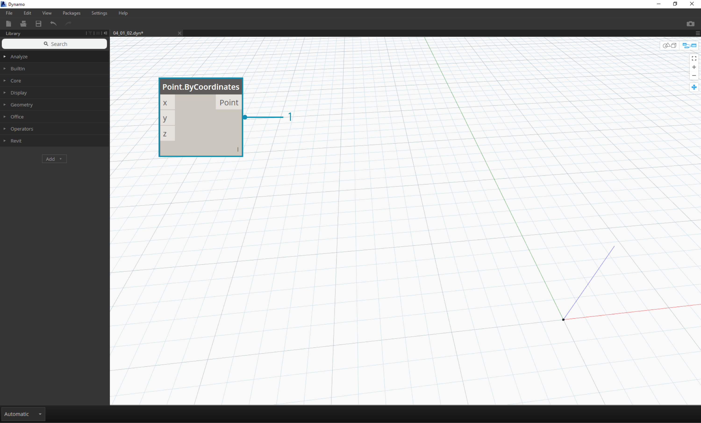
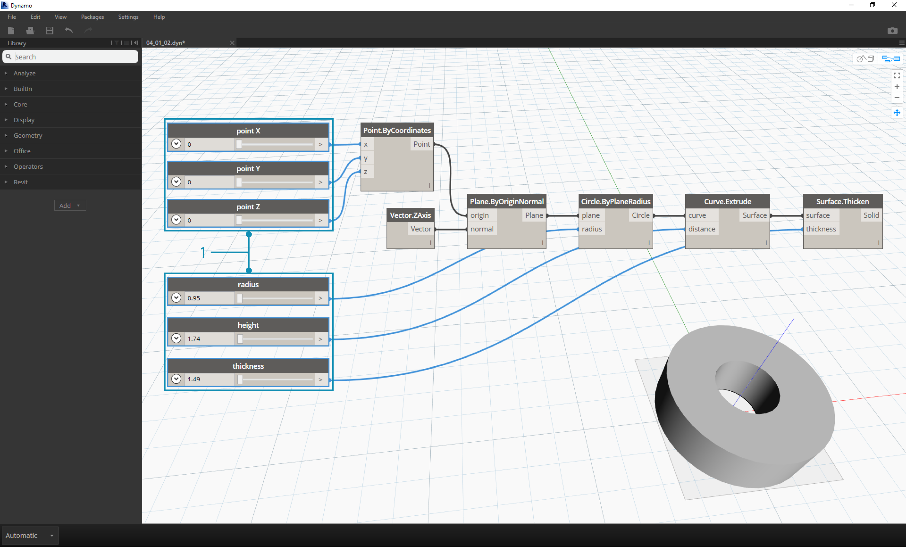

##Data   数据
Data is the stuff of our programs. It travels through Wires, supplying inputs for Nodes where it gets processed into a new form of output data. Let's review the definition of data, how it's structured, and begin using it in Dynamo.

数据是我们计划的东西。它穿过导线,提供输入节点,它被加工成一种新形式的输出数据。让我们回顾数据的定义,它是如何结构化,并开始使用发电机。


###What is Data?   什么是数据
Data is a set of values of qualitative or quantitative variables. The simplest form of data is numbers such as ```0```, ```3.14```, or ```17```. But data can also be of a number of different types: a variable representing changing numbers (```height```); characters (```myName```); geometry (```Circle```); or a list of data items (```1,2,3,5,8,13,...```). We need data to add to the input Ports of Dynamo's Nodes - we can have data without actions but we need data to process the actions that our Nodes represent. When we've added a Node to the Workspace, if it doesn't have any inputs supplied, the result will be a function, not the result of the action itself.


数据是一组值的定性或定量变量。最简单的形式的数据是数字,如' ' ' 0 ' ' ' ' ' ' 3.14 ' ' '或' ' ' '“17”。但数据也可以很多不同的类型:一个变量代表改变数字(' ' '高' ' '),人物(' ' '名字' ' ');几何(' ' '圆' ' ');或一个数据项列表(“”1、2、3、5、8、13日…”“)。我们需要数据添加到输入端口的发电机节点——我们可以有数据没有动作,但是我们需要数据来处理我们的节点代表的行动。当我们将一个节点添加到工作区,如果它没有任何输入提供,结果将是一个函数,而不是行动本身的结果。


> 1. Simple Data
2. Data and Action (A Node) successfully executes
3. Action (A Node) without Data Inputs returns a generic function

> 1.简单的数据
> 
> 2.数据和行动(节点)成功地执行
> 
> 3.所示操作(节点)没有数据输入返回一个泛型函数
> 


###Beware of Nulls    当心出错

The ```'null'``` type represents the absence of data. While this is an abstract concept, you will likely come across this while working with Visual Programming. If an action doesn't create a valid result, the Node will return a null. Testing for nulls and removing nulls from data structure is a crucial part to creating robust programs.

”的“零' ' ' '类型代表数据的缺失。虽然这是一个抽象的概念,你可能会遇到与此同时使用可视化编程。如果一个动作不创建一个有效的结果,该节点将返回null。测试null和删除取消从数据结构创建健壮的程序是一个至关重要的部分。


| Icon | Name/Syntax | Inputs | Outputs |
| -- | -- | -- | -- | -- | -- |
|  | Object.IsNull | obj | bool |


| 图标 | 名称/语法 | 输入 | 输出 |
| -- | -- | -- | -- | -- | -- |
|  | Object.IsNull | obj | bool |


###Data Structures    数据结构
When we are Visual Programming, we can very quickly generate a lot of data and require a means of managing its hierarchy. This is the role of Data Structures, the organizational schemes in which we store data. The specifics of Data Structures and how to use them vary from programming language to programming language. In Dynamo, we add hierarchy to our data through Lists. We will explore this in depth in later chapters, but let's start simply:


当我们可视化编程,我们可以很快产生大量的数据,需要管理其层次结构的一种手段。这是数据结构的作用,组织计划我们存储数据。数据结构的细节以及如何使用它们不同的编程语言,编程语言。在发电机中,我们添加了层次结构数据通过列表。我们将深入探索这个在以后的章节,但让我们开始简单的:


A list represents a collection of items placed into one structure of data:
* I have five fingers (*items*) on my hand (*list*).
* There are ten houses (*items*) on my street (*list*).


代表一组条目列表放入一个数据结构:
* 我有五个手指(* *)项目在我的手(* *)列表。
* 有十个房子我大街上(* *)项目(* *)列表。


> 1. A **Number Sequence** node defines a list of numbers by using a *start*, *amount*, and *step* input. With these nodes, we've created two separate lists of ten numbers, one which ranges from *100-109* and another which ranges from *0-9*.
2. The **List.GetItemAtIndex** node selects an item in a list at a specific index.  When choosing *0*, we get the first item in the list (*100* in this case).
3. Applying the same process to the second list, we get a value of *0*, the first item in the list.
4. Now we merge the two lists into one by using the **List.Create** node.  Notice that the node creates a *list of lists.* This changes the structure of the data.
5. When using **List.GetItemAtIndex** again, with index set to *0*, we get the first list in the list of lists.  This is what it means to treat a list as an item, which is somewhat different from other scripting languages. We will get more advanced with list manipulation and data structure in later chapters.

> 1.* * * *号码序列节点定义一个数字列表使用* *开始,* *,和* *步输入。这些节点,我们已经创建了两个列表的十个数字,一个范围从100 - 109 * *,另一范围从* 0 - 9 *。
> 2.**列表。GetItemAtIndex * *节点列表中选择一个项目在一个特定的索引。在选择* 0 *,我们得到第一项在列表中(* 100 *在这种情况下)。
> 3.所示相同的过程应用到第二个列表,我们得到的值* 0 *,列表中的第一项。
> 4.所示现在我们合并这两个列表使用* *到一个列表中。创建* *节点。注意节点创建一个*的名单列表。*这改变的结构数据。
> 5当使用**列表。再次GetItemAtIndex * *,指数* 0 *,我们得到了第一个列表中的列表的列表。这是意味着什么治疗作为一个项目列表,这是有点不同于其他脚本语言。我们将得到更高级的操作和数据结构在以后的章节列表。


The key concept to understand about data hierarchy in Dynamo: **with respect to data structure, lists are regarded as items.**  In other words, Dynamo functions with a top-down process for understanding data structures. What does this mean? Let's walk through it with an example.

发电机的关键概念理解数据层次结构:* *对数据结构,被视为项目列表。* *换句话说,发电机功能与自顶向下的过程对于理解数据结构。这是什么意思?让我们走过了一个例子。


### Using Data to Make a Chain of Cylinders

###  使用数据链的圆柱体


>Download the example file that accompanies this exercise (Right click and "Save Link As..."): [Building Blocks of Programs - Data.dyn](datasets/4-1/Building Blocks of Programs - Data.dyn). A full list of example files can be found in the Appendix.

>下载附带的示例文件这个练习(右点击“链接另存为…”):[项目——数据的构建块。达因)([Building Blocks of Programs - Data.dyn](datasets/4-1/Building Blocks of Programs - Data.dyn))。示例文件的完整列表可以在附录中找到。


In this first example, we assemble a shelled cylinder which walks through the geometry hierarchy discussed in this section.

在第一个例子中,我们组装的炮击缸穿过几何层次结构在本节中讨论。



> 1. **Point.ByCoordinates -** after adding the node to canvas, we see a point at the origin of the Dynamo preview grid.  The default values of the *x,y*, and *z* inputs are *0.0*, giving us a point at this location.
> 

> 1.**点。ByCoordinates - * *添加节点到画布上之后,我们看到一个在发电机预览网格的起源点。的默认值* x,y,z和* * * 0.0 *输入,给我们一个点在这个位置。


> 1. **Plane.ByOriginNormal -** The next step in the geometry hierarchy is a plane.  There are several ways to construct a plane, and we are using an origin and normal for the input.  The origin is the point node created in the previous step.
2. **Vector.ZAxis -** this is a unitized vector in the z direction.  Notice there are not inputs, only a vector of [0,0,1] value.  We use this as the *normal* input for the *Plane.ByOriginNormal* node.  This gives us a rectangular plane in the Dynamo preview.

> 1.**飞机。ByOriginNormal - **几何层次结构中的下一步是一个平面。有几种方法可以构造一个平面,我们使用一个起源和正常的输入。原点是节点在上一步中创建的。
>  2.**向量。z轴- * *这是一个组合向量在z方向。注意没有输入,只有一个向量[0,0,1]值。我们用这个作为* *正常*输入平面。ByOriginNormal *节点。这给了我们一个矩形平面电机的预览。


> 1. **Circle.ByPlaneRadius -** Stepping up the hierarchy, we now create a curve from the plane in our previous step.  After plugging into the node, we get a circle at the origin.  The default radius on the node is value of *1*.
> 

> 1。* *圆。ByPlaneRadius——* *加大层次结构,我们现在在我们之前创建一个曲线从飞机上一步。插入到节点后,我们得到了一个圆在原点。默认的半径* 1 *的节点值。
> 


> 1. **Curve.Extrude -** Now we make this thing pop by giving it some depth and going in the third dimension.  This node creates a surface from a curve by extruding it.  The default distance on the node is *1*, and we should see a cylinder in the viewport.
> 

> 1。* *曲线。挤压——* *现在我们让这个东西流行用一些深度和在第三维度。这个节点创建一个表面曲线的挤压。节点上的违约距离* 1 *,我们应该看到一个气缸的视窗。
> 


> 1. **Surface.Thicken -** This node gives us a closed solid by offsetting the surface a given distance and closing the form.  The default thickness value is *1*, and we see a shelled cylinder in the viewport in line with these values.
> 

> 1。* *表面。加厚- * *这个节点给了我们一个封闭的固体通过给定距离抵消表面和关闭表单。默认厚度值* 1 *,我们看到视窗的炮击缸符合这些值。
> 


> 1. **Number Slider -** Rather than using the default values for all of these inputs, let's add some parametric control to the model.
2. **Domain Edit - **after adding the number slider to the canvas, click the caret in the top left to reveal the domain options.
3. **Min/Max/Step -** change the *min*, *max*, and *step* values to *0*,*2*, and *0.01* respectively. We are doing this to control the size of the overall geometry.

> 1.**号码滑块- * *而不是使用所有这些默认值输入,让我们添加一些参数控制的模型。
> 
> 2.。**域编辑- * *向画布添加滑块数量后,点击左上角的插入符号揭示域选项。
> 
> 3.所示**最小/最大/步骤- * *改变*分*,*马克斯•*和* *值* 0 *步,分别为0.01 * 2 *,* *。我们这样做是为了控制整体结构的大小。
> 


> 1. **Number Sliders -** In all of the default inputs, let's copy and paste this number slider (select the slider, hit Ctrl+C, then Ctrl+V) several times, until all of the inputs with defaults have a slider instead.  Some of the slider values will have to be larger than zero to get the definition to work (ie: you need an extrusion depth in order to have a surface to thicken).
> 

> 1**号码滑块- **在所有默认的输入,我们复制和粘贴这个数字滑块(选择滑块,点击Ctrl + C,然后按Ctrl + V)几次,直到所有的输入缺省值有一个滑块。滑块的值必须大于零的定义工作(即:你需要一个挤压深度为了有表面增稠)。


We've now created a parametric shelled cylinder with these sliders.  Try to flex some of these parameters and see the geometry update dynamically in the Dynamo viewport.

现在我们已经创建了一个参数炮击缸与这些滑块。试着flex其中一些参数和发电机的几何动态更新窗口。



> 1. **Number Sliders -** taking this a step further, we've added a lot of sliders to the canvas, and need to clean up the interface of the tool we just created.  Right click on one slider, select "Rename..." and change each slider to the appropriate name for its parameter.  You can reference the image above for names.

> 1.**号码滑块- **在这一步,我们增加了很多滑块到画布上,并需要清理我们刚刚创建的接口工具。右键单击一个滑动条,选择“重命名…”,改变每个滑块到适当的名称的参数。你可以参考上图的名字。


At this point, we've created an awesome thickening cylinder thing.  This is one object currently, let's look at how to create an array of cylinders that remains dynamically linked.  To do this, we're going to create a list of cylinders, rather than working with a single item.

在这一点上,我们已经创建了一个了不起的增厚圆柱的事情。这是目前一个对象,让我们看看如何创建一个数组是动态链接的圆柱体。要做到这一点,我们将创建一个圆柱体的列表,而不是与一个合作项目。


> 1. **Addition (+) -** Our goal is to add a row of cylinders next to the cylinder we've created.  If we want to add one cylinder adjacent to the current one, we need to consider both radius of the cylinder and the thickness of its shell.  We get this number by adding the two values of the sliders.

> 1**添加(+)- **我们的目标是增加一排汽缸缸我们已经创建了。如果我们想要添加一个缸附近,我们需要考虑圆柱的半径和壳的厚度。我们得到这个数字增加滑块的两个值。


> This step is more involved so let's walk through it slowly: the end goal is to create a list of numbers which define the locations of each cylinder in a row.
1. **Multiplication -** First, we want to multiply the value from the previous step by 2. The value from the previous step represents a radius, and we want to move the cylinder the full diameter.
2. **Number Sequence -** we create an array of numbers with this node.  The first input is the *multiplication* node from the previous step into the *step* value.  The *start* value can be set to *0.0* using a *number* node.
3.  **Integer Slider - ** For the *amount* value, we connect an integer slider. This will define how many cylinders are created.
4. **Output - ** This list shows us the distance moved for each cylinder in the array, and is parametrically driven by the original sliders.

> 这一步是更多的参与让我们慢慢地走过,最终的目标是创建一个列表数据定义每个气缸的位置.
> 
> 1.乘法** - **首先,我们想上一步的价值乘以2。上一步中的值代表一个半径,我们想把缸外径。
> 
> 2.* ** *号码序列-我们与这个节点创建一个数组的数字。第一个输入*乘法*节点从上一步进入* *步值。* *开始值可以设置为使用*人数* * 0.0 *节点。
> 
> 3.所示。**整数滑块- ****价值,我们连接一个滑块的整数。这将定义创建了多少的圆柱体。
> 
> 4.所示.输出-****这个清单向我们展示了移动的距离数组,每个缸的参数化,并由原来的滑动条。
> 


> 1. This step is simple enough - plug the sequence defined in the previous step into the *x* input of the original *Point.ByCoordinates*.  This will replace the slider *pointX* which we can delete. We now see an array of cylinders in the viewport (make sure the integer slider is larger than 0).

> 1.这一步很简单,前面步骤中定义的顺序插入* x *输入的原始* Point.ByCoordinates *。这将取代滑块* pointX *我们可以删除。我们现在看到的数组圆柱体的视窗(确保整数滑块大于0)。


> The chain of cylinders is still dynamically linked to all of the sliders.  Flex each slider to watch the definition update!

>气缸链仍动态链接的所有滑块.Flex每个滑块看定义更新!


