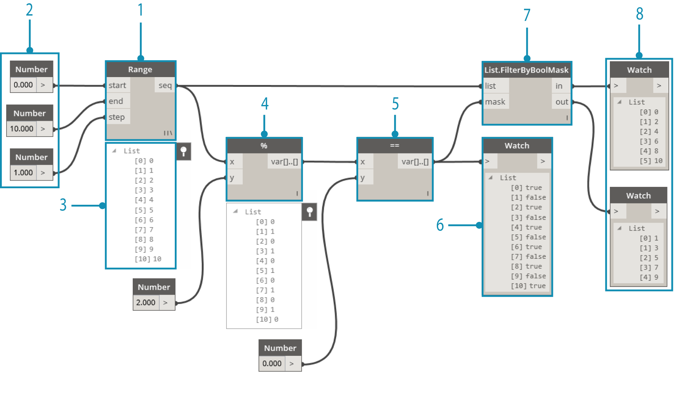
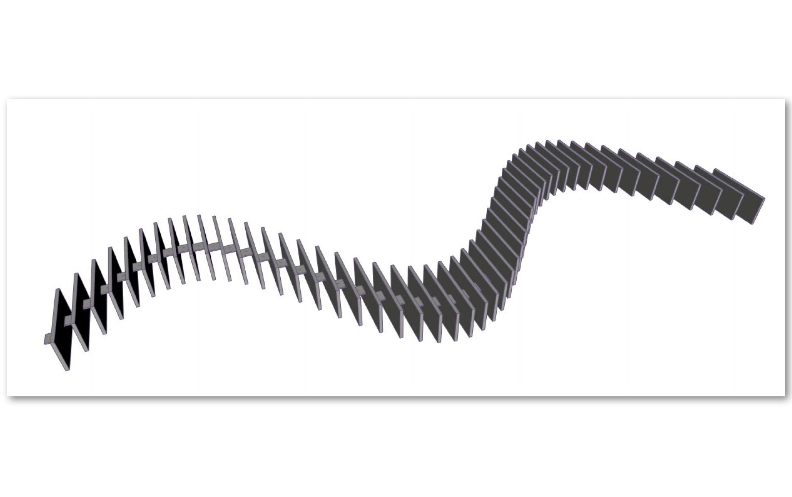
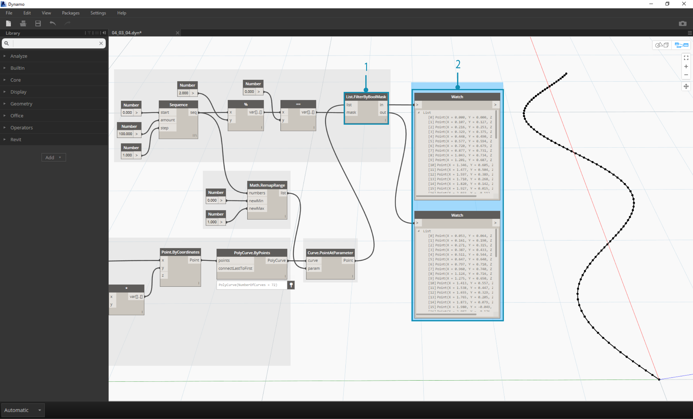

##Logic    逻辑学
**Logic**, or more specifically, **Conditional Logic**, allows us to specify an action or set of actions based on a test. After evaluating the test, we will have a Boolean value representing ```True``` or ```False``` that we can use to control the Program Flow.

** 逻辑**,或者更具体地说,** 条件逻辑**,允许我们指定一个操作或一组操作基于测试。评估测试后,我们将有一个布尔值表示““真”“或“假的”“我们可以用来控制程序流。


###Booleans   布尔值
Numeric variables can store a whole range of different numbers. Boolean variables can only store two values referred to as True or False, Yes or No, 1 or 0. We rarely use booleans to perform calculations because of their limited range.

数值型变量可以存储一系列的不同的数字。布尔变量只能存储两个值称为或真或假,是或否,1或0。我们很少使用布尔值执行计算因为它们有限的活动范围。


###Conditional Statements    条件语句
The "If" statement is a key concept in programming: "If *this* is true, then *that* happens, otherwise *something else* happens. The resulting action of the statement is driven by a boolean value. There are multiple ways to define an "If" statement in Dynamo:


“如果”语句编程中的关键概念:“如果* *是如此,那么* *发生,否则会发生*别的*。语句的生成的行动是由一个布尔值。有很多方法可以定义一个“如果”声明在发电机:


| Icon | Name | Syntax| Inputs | Outputs |
| -- | -- | -- | -- | -- | -- |-- |
|  | If | If | test, true, false | result|
|  | Formula | IF(x,y,z) | x, y, z | result |
|  | Code Block | (x?y:z)| x, y, z | result|
Let's go over a brief example on each of these three nodes in action using the conditional "If" statement:

我们走在一个简单的例子在行动这三个节点使用条件“如果”语句:


> In this image, the *boolean* is set to *true*, which means that the result is a string reading: *"this is the result if true".*  The three Nodes creating the *If* statement are working identically here.
\


>在这幅图像中,*布尔* *真正的*,这意味着结果是一个字符串阅读:*“结果如果如此”。*三个节点创建* *声明是否工作相同。

> Again, the Nodes are working identically.  If the *boolean* is changed to *false*, our result is the number *Pi*, as defined in the original *If* statement.


>,节点工作相同。如果更改为* *布尔*假*,我们的结果是*π*数量,在原来的*如果*声明中定义。

###Filtering a List   对一个列表进行过滤
>Download the example file that accompanies this exercise (Right click and "Save Link As..."): [Building Blocks of Programs - Logic.dyn](datasets/4-3/Building Blocks of Programs - Logic.dyn). A full list of example files can be found in the Appendix.


>下载附带的示例文件这个练习(右点击“链接另存为…”):[构建模块的程序-逻辑。达因)([Building Blocks of Programs - Logic.dyn](datasets/4-3/Building Blocks of Programs - Logic.dyn))。示例文件的完整列表可以在附录中找到。


Let's use logic to separate a list of numbers into a list of even numbers and a list of odd numbers.


让我们使用逻辑分离一个数字列表的列表偶数和奇数的列表。



> 1. **Number Range -** add a number range to the canvas.
2. **Numbers -** add three number nodes to the canvas.  The value for each number node should be: *0.0* for *start*, *10.0* for *end*, and *1.0* for *step*.
3. **Output - ** our output is a list of 11 numbers ranging from 0-10.
4. **Modulo (%)-** *Number Range* into *x* and *2.0* into *y*.  This calculates the remainder for each number in the list divided by 2. The output from this list gives us a list of values alternating between 0 and 1.
5. **Equality Test (==) -** add an equality test to the canvas.  Plug *modulo* output into the *x* input and *0.0* into the *y* input.
6. **Watch -** The output of the equality test is a list of values alternating between true and false.  These are the values used to separate the items in the list.  *0* (or *true*) represents even numbers and (*1*, or *false*) represents odd numbers.
6. **List.FilterByBoolMask -** this Node will filter the values into two different lists based on the input boolean.  Plug the original *number range* into the *list* input and the *equality test** output into the *mask* input.  The *in* output represents true values while the *out* output represents false values.
7. **Watch - ** as a result, we now have a list of even numbers and a list of odd numbers. We've used logical operators to separate lists into patterns!


> 1.* *号码范围- * *数量范围添加到画布。
> 
> 2.* *数据——* *三号节点添加到画布。每个数量节点的值应该是:* 0.0 * * *开始,结束* * * 10.0 *,* * 1.0 * *步骤。
> 
> 3.所示。输出* * - * *我们的输出是11个数字从清廉的列表。
> 
> 4.所示。* *模(%):* * *数量范围*到* x *和* 2.0 * * *。这个计算其余列表中的每个数除以2。这个列表给我们提供了一个列表的输出值的交替在0和1之间。
> 
> 5.平等测试(= =)- * * * *一个平等的测试添加到画布。*模*输出插入* x *输入和* 0.0 * * y *输入。
> 
> 6.* *看- * *平等的输出测试的列表值真假之间交替。这些值用于分隔列表中的项目。* 0 *(或*真*)代表偶数和(* 1 *或*假*)代表奇数。
> 
> 6.* *列表。FilterByBoolMask——* *这个节点将筛选到两个不同的值列表根据输入布尔。原始*数量范围*插入列表* *平等测试输入和* * *到*屏蔽*输入输出。* *输出代表真正的价值观而* *输出代表错误的价值观。
> 
> 7.所示.* *看- * *结果,我们现在有一个列表的偶数和奇数的列表。我们使用逻辑运算符来分隔列表模式!
> 


###From Logic to Geometry     从逻辑到几何
Building off of the logic established in the first exercise, let's apply this setup into a modeling operation.

建筑的逻辑建立在第一运动,让我们应用此设置成operation.y建模


> 1. We'll jump off from the previous exercise with the same Nodes.  The only exceptions:
2. We've changed the format.
3. The input values have changed.
4. We've unplugged the in list input into *List.FilterByBoolMask*. We'll put these Nodes aside for now, but they'll come in handy later in the exercise.


> 1.我们从前面跳下运动与相同的节点。唯一的例外:
> 
> 2.我们已经改变了格式。
> 
> 3.所示.输入值已经改变了。
> 
> 4.所示.我们已经在列表中输入* List.FilterByBoolMask *拔掉。我们将把这些节点放在一边,但他们迟早会在锻炼。
> 


> Let's begin by connecting the Nodes together as shown in the image above. This group of Nodes represents a parametric equation to define a line curve. A few notes:
1. The **first slider** should have a min of 1, a max of 4, and a step of 0.01.
2. The **second slider** should have a min of 0, a max of 1, and a step of 0.01.
3. **PolyCurve.ByPoints -** if the above Node diagram is copied, the result is a sine curve in the Dynamo Preview viewport.

>让我们一起开始通过连接节点,如上图所示。这一组的节点定义一条线代表一个参数方程曲线。一些笔记:
>
>1。* * * *第一滑块应该有一个1分钟,马克斯•4和0.01步骤。
>
>2。* * * *第二滑块都应该有一个最小值为0,最大值1,步骤0.01。
>
>3所示。* * PolyCurve。ByPoints - * *如果上述节点图复制,结果是一个正弦曲线的发电机预览窗口。
>


The method here for the inputs: use number nodes for more static properties and number sliders on the more flexible ones.  We want to keep the original number range that we're defining in the beginning of this step.  However, the sine curve that we create here should have some flexibility.  We can move these sliders to watch the curve update its frequency and amplitude.


输入的方法:使用节点数量更多的静态属性和更加灵活的滑块数量。我们想保持原来的数量范围,我们定义的开始这一步。然而,这里我们创建的正弦曲线应该有一些灵活性。我们可以把这些滑块移动到看曲线更新频率和振幅。


> We're going to jump around a bit in the definition, so let's look at the end result so that we can reference what we're getting at.  The first two steps are made separately, we now want to connect the two.  We'll use the base sine curve to drive the location of the zipper components, and we'll use the true/false logic to alternate between little boxes and larger boxes.


>我们会跳来跳去定义,所以让我们看看最终结果我们得到什么,我们可以参考。前两个步骤分别,我们现在想连接。我们将使用正弦曲线底部开拉链的位置组件,和我们将使用真/假逻辑小盒和大箱之间的交替。


> 1. **Math.RemapRange - ** Using the number sequence created in step 01, let's create a new series of numbers by remapping the range.  The original numbers from step 01 range from 0-100.  These numbers range from 0 to 1 by the *newMin* and *newMax* inputs respectively.

> 1。* *数学。RemapRange - * *使用数字序列在步骤1中创建,让我们创建一个新系列的数字范围重新映射。最初的数字从01范围从0 - 100步。这些数字从0到1 * newMin *和* newMax *分别输入。


> 1. **Curve.PointAtParameter - ** Plug *Polycurve.ByPoints* (from step 2) into *curve* and *Math.RemapRange* into *param*. This step creates points along the curve. We remapped the numbers to 0 to 1 because the input of *param* is looking for values in this range.  A value of *0* represents the start point, a value of *1* represents the end points.  All numbers in between evaluate within the *[0,1]* range.

> 1。* *曲线。PointAtParameter - * *塞* Polycurve。ByPoints *(从步骤2)在* *和*数学曲线。RemapRange * *参数*。此步骤创建点沿着曲线。我们重新映射0到1的数字,因为输入的参数* *正在寻找在这个范围值。* 0 *的值代表了起点,* 1 *的值代表了终点。所有数字之间的评估在*[0,1]*范围内。



> 1. **List.FilterByBoolMask - ** Plug *Curve.PointAtParameter* from the previous step into the *list* input.
2. **Watch -** a watch node for *in* and a watch node for *out* shows that we have two lists representing even indices and odd indices.  These points are ordered in the same way on the curve, which we demonstrate in the next step.

> 1。* *列表。FilterByBoolMask - * *塞*曲线。PointAtParameter *从上一步进入* *输入列表。
2。* *表——* *表节点的* *和手表节点为* *显示,我们有两个代表甚至指数和奇数项列表。这些点是要求以同样的方式在曲线上,我们在下一步中展示。


> 1. **Cuboid.ByLengths -** recreate the connections seen in the image above to get a zipper along the sine curve. A cuboid is just a box here, and we're defining its size based on the curve point in the center of hte box.  The logic of the even/odd divide should now be clear in the model.


> 1。* *长方体。ByLengths - * *创建连接的上图拉链沿着正弦曲线。长方体只是一个盒子,我们定义它的大小根据曲线点在中心的盒子。偶数/奇数的逻辑划分现在应该明确的模型中。


> 1. **Number Slider -** stepping back to the beginning of the definition, we can flex the number slider and watch the zipper update.  The top row of images represents a range values for the top number slider. This is the frequency of the wave.
2. **Number Slider -** the bottom row of images represents a range of values for the bottom slider.  This is the amplitude of the wave.


> 1。* *号码滑块- * *退到后面,开始的定义,我们可以flex拉链滑块,看数量更新。第一行的图片代表一个范围值前滑块数量。这是波的频率。
2。* *号码滑块- * *最后一行图像底部滑块代表一个范围的值。这是波的振幅。


