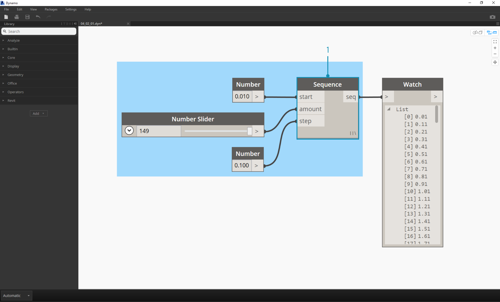
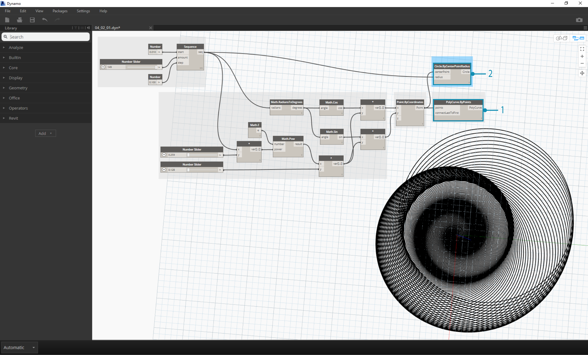

##Math   数学 
If the simplest form of data is numbers, the easiest way to relate those numbers is through Mathematics. From simple operators like divide to trigonometric functions, to more complex formulas, Math is a great way to start exploring numeric relationships and patterns.

如果最简单的形式的数据是数字,最简单的方法把这些数字是通过数学。从简单的运营商将三角函数,到更复杂的公式,数学是一个伟大的方式开始探索数字关系和模式。

###Arithmetic Operators    算术运算符
Operators are a set of components that use algebraic functions with two numeric input values, which result in one output value (addition, subtraction, multiplication, division, etc.). These can be found under Operators>Actions.

运营商的一套组件,这些组件使用代数函数和两个数字输入值,导致一个输出值(加法,减法,乘法,除法,等等)。这些可以找到运营商>操作。

| Icon | Name | Syntax| Inputs | Outputs |
| -- | -- | -- | -- | -- | -- |-- |
|  | Add | + | var[]...[], var[]...[] | var[]...[] |
|  | Subtract | - | var[]...[], var[]...[] | var[]...[] |
|  | Multiply | * | var[]...[], var[]...[] | var[]...[] |
|  | Divide | / | var[]...[], var[]...[] | var[]...[] |

###Parametric Formula     参数化公式
>Download the example file that accompanies this exercise (Right click and "Save Link As..."): [Building Blocks of Programs - Math.dyn](datasets/4-2/Building Blocks of Programs - Math.dyn). A full list of example files can be found in the Appendix.

>下载附带的示例文件这个练习(右点击“链接另存为…”):[构建块的程序——数学。达因)([Building Blocks of Programs - Math.dyn](datasets/4-2/Building Blocks of Programs - Math.dyn).)。示例文件的完整列表可以在附录中找到。

From Operators, the next logical step is to combine operators and variables to form a more complex relationship through **Formulas**. Let's make a Formula that can be controlled by input parameters, like sliders.

从运营商,下一个逻辑步骤是操作符和变量结合,形成一个更复杂的公式通过* * * *的关系。让我们做一个公式,可以控制的输入参数,如滑块。

>1. **Number Sequence:** define a number sequence based on three inputs: *start, amount* and *step*.  This sequence represents the 't' in the parametric equation, so we want to use a list that's large enough to define a spiral.

> 1.**序列数量:**定义一个数字序列基于三个输入:*,*和* *。这个序列代表了“t”参数方程,所以我们要使用一个足够大的列表定义一个螺旋。

The step above has created a list of numbers to define the parametric domain.  The golden spiral is defined as the equation:  = and
=. The group of Nodes below represent this equation in visual programming form.

上面的步骤创建了一个数字列表定义参数域。黄金螺旋线方程定义为:= 和
= 。下面的组节点代表这个方程可视化编程形式。

> When stepping through the group of Nodes, try to pay attention to the parallel between the visual program and written equation.
1. **Number Slider:** Add two number sliders to the canvas.  These sliders will represent the *a* and the *b* variables of the parametric equation.  These represent a constant which is flexible, or parameters which we can adjust towards a desired outcome.
2. ** * :** The multiplication Node is represented by an aseterisk.  We'll use this repeatedly to connect multiplying variables
3. **Math.RadiansToDegrees:** The '*t*' values need to be translated to degrees for their evaluation in the trigonometric functions.  Remember, Dynamo defaults to degrees for evaluating these functions.
4. **Math.Pow:** as a function of the '*t*' and the number '*e*' this creates the Fibonacci sequence.
5. **Math.Cos and Math.Sin:**  These two trigonmetric functions will differentiate the x-coordinate and the y-coordinate, respectively, of each parametric point.
6.  **Watch: **We now see that our output is two lists, these will be the *x* and *y* coordinates of the points used to generate the spiral.

> 当步进通过群节点,尽量注意视觉之间的并行程序和书面方程.
> 
> 1.* *滑块数量:* *添加两个滑块到画布上。这些滑块将代表* *,* b *变量的参数方程。这些代表一个常数是灵活的,或参数,我们可以调整到所需的结果。
> 
> 2.** *:**乘法节点由一个aseterisk表示。我们将使用此反复连接变量相乘
> 
> 3.所示。**数学。RadiansToDegrees:* * * t *的值需要翻译为三角函数的评价度。记住,发电机来评估这些功能默认为度。
> 
> 4.所示.**数学。战俘:* *的函数“* t *”和“* e *”这创造了斐波那契序列。
> 
> 5.**数学。因为和数学。罪:* *这两个trigonmetric函数将区分x坐标和y坐标,分别对每个参数的观点。
> 
> 6.* ** *注意:我们现在看到我们的输出是两个列表,这些将是* x *和* *的点的坐标用于生成螺旋。
> 

###From Formula to Geometry     从几何公式
Now, the bulk of Nodes from the previous step will work fine, but it is a lot of work.  To create a more efficient workflow, have a look at **Code Blocks** (section 3.3.2.3) to define a string of Dynamo expressions into one node.  In this next series of steps, we'll look at using the parametric equation to draw the Fibonacci spiral.

现在,大部分节点前一步的工作很好,但这是一个大量的工作。创建一个更高效的工作流程,看看* *代码块* *(3.3.2.3节)来定义一个发电机表达式的字符串为一个节点。在本系列接下来的步骤,我们将看看用参数方程画出斐波那契螺旋。

> 1. **Point.ByCoordinates:** Conect the upper multiplication node into the '*x*' input and the lower into the '*y*' input. We now see a parametric spiral of points on the screen.

> 1.**点.ByCoordinates:**上乘法节点连接到“* * *”和下输入* y *的输入。我们现在看到的参数螺旋点在屏幕上。

> 1. **Polycurve.ByPoints:** Conect Point.ByCoordinates from the previous step into *points*.  We can leave *connectLastToFirst* without an input because we aren't making a closed curve.  This creates a spiral which passes through each point defined in the previous step.

> 1.** Polycurve。ByPoints:**连接。ByCoordinates从上一步变成*分*。我们可以离开* connectLastToFirst *输入,因为我们不闭合曲线。这将创建一个螺旋通过每个点在前一步骤中定义。

We've now completed the Fibonacci Spiral!  Let's take this further into two separate exercises from here, which we'll call the Nautilus and the Sunflower.  These are abstractions of natural systems, but the two different applications of the Fibonacci spiral will be well represented.

现在,我们已经完成了斐波那契螺旋!让我们更进一步到两个独立的运动从这里开始,我们将称之为鹦鹉螺和向日葵。这些都是自然系统的抽象,但斐波那契螺旋的两个不同的应用程序将会代表。

###From Spiral to Nautilus    从螺旋鹦鹉螺

> 1. As a jumping-off point, let's start with the same step from the previous exercise: creating a spiral array of points with the **Point.ByCoordinates** Node.

> 1.作为一个起点,让我们开始与前面相同的步骤练习:创建一个螺旋阵列点**点。ByCoordinates **节点。

> 1. **Polycurve.ByPoints:** Again, this is the Node from the pervious exercise, which we'll use as a reference.
2. **Circle.ByCenterPointRadius:** We'll use a circle Node here with the same inputs as the previous step.  The radius value defaults to *1.0*, so we see an immediate output of circles. It becomes immediately legible how the points diverge further from the origin.

> 1.** Polycurve。再次ByPoints:**,这是透光的节点运动,我们将使用作为参考。
2.**圆。ByCenterPointRadius:**我们将使用一个圆结点有相同的输入上一步。半径值默认为* 1.0 *,所以我们看到立即输出的圆圈。立即变得清晰点偏离如何进一步从原点。

> 1. **Circle.ByCenterPointRadius:** To create a more dynamic array of circles, we plug the original number sequence (the '*t*' sequence) into the radius value.
2. **Number Sequence:** This is the original array of '*t*'.  By plugging this into the radius value, the circle centers are still diverging further from the origin, but the radius of the circles is increasing, creating a funky Fibonacci circle graph.  Bonus points if you make it 3D!

> 1.**圆。ByCenterPointRadius:**创建一个动态数组的圈子里,我们把原来的数字序列(* t *的序列)半径值。
> 
> 2.**序列数量:**的原始数组* t *。通过堵塞半径值,圆中心仍进一步偏离原点,但是圆圈的半径增加,创建一个时髦的斐波那契圆图。加分,如果你使它3 d !
> 

###From Nautilus to Phyllotaxis Pattern     从Nautilus叶序模式 
Now that we've made a circular Nautilus shell, let's jump into parametric grids.  We're going to use a basic rotate on the Fibonacci Spiral to create a Fibonacci grid, and the result is modeled after the [growth of sunflower seeds.](http://ms.unimelb.edu.au/~segerman/papers/sunflower_spiral_fibonacci_metric.pdf)

既然我们已经做了一个圆形的鹦鹉螺,让我们跳进参数网格。我们要用一个基本的旋转在斐波那契螺旋创建一个斐波那契网格,结果是仿照(葵花籽的增长。)([growth of sunflower seeds.](http://ms.unimelb.edu.au/~segerman/papers/sunflower_spiral_fibonacci_metric.pdf))

> 1. Again, as a jumping-off point, let's start with the same step from the previous exercise: creating a spiral array of points with the **Point.ByCoordinates** Node.

> 1.再次,作为一个起点,让我们开始与前面相同的步骤练习:创建一个螺旋阵列点* *点。ByCoordinates * *节点。

> 1. **Geometry.Rotate:** There are several Geometry.Rotate options; be certain you've chosen the Node with *geometry*,*basePlane*, and *degrees* as its inputs.  Connect **Point.ByCoordinates** into the geometry input.
2. **Plane.XY:** Connect to the *basePlane* input. We will rotate around the origin, which is the same location as the base of the spiral.
3. **Number Range:** For our degree input, we want to create multiple rotations. We can do this quickly with a Number Range component.  Connect this into the *degrees* input.
4. **Number:** And to define the range of numbers, add three number nodes to the canvas in vertical order. From top to bottom, assign values of *0.0,360.0,* and *120.0* respectively.  These are driving the rotation of the spiral.  Notice the output results from the **Number Range** node after connecting the three number nodes to the Node.

> 1.**几何学。旋转:* *有几个几何。旋转选项;确定你所选择的节点几何* *,* *底平面*,*度作为它的输入。连接* *点。ByCoordinates * *到几何输入。
> 
> 2.**飞机。XY:* * *底平面*输入连接。我们将旋转原点,这是相同的位置为基础的螺旋。
> 
> 3.所示。**数量范围:* *对我们的输入,我们想创建多个旋转。我们可以迅速与一些组件。连接到* *度输入。
> 
> 4.所示.**数量:* *和定义数据的范围,向画布添加三个节点数量在垂直秩序。从上到下,赋值* 0.0,360.0,分别*和* 120.0 *。这些是驱动的旋转螺旋。注意到输出结果后从* *数量范围* *节点连接的三个节点的节点数量。
> 

Our output is beginning to resemble a whirlpool.  Let's adjust some of the **Number Range** parameters and see how the results change:

我们的输出开始像一个漩涡。让我们调整一些* *数量范围* *参数,看看结果变化:

> 1. Change the step size of the **Number Range** node from *120.0* to *36.0*.  Notice that this is creating more rotations and is therefore giving us a denser grid.

> 1.变化的步长* ** *范围节点数量从120.0 * 120.0 ***。请注意,这是创造更多的旋转,因此给了我们一个密集的网格。

> 1. Change the step size of the **Number Range** node from *36.0* to *3.6*.  This now gives us a much denser grid, and the directionality of the spiral is unclear.  Ladies and gentlemen, we've created a sunflower.

> 1.变化的步长* * * *范围节点数量从36.0 * 36.0 * * *。现在让我们更密集的网格,螺旋的方向还不清楚。女士们,先生们,我们已经创建了一个向日葵。

