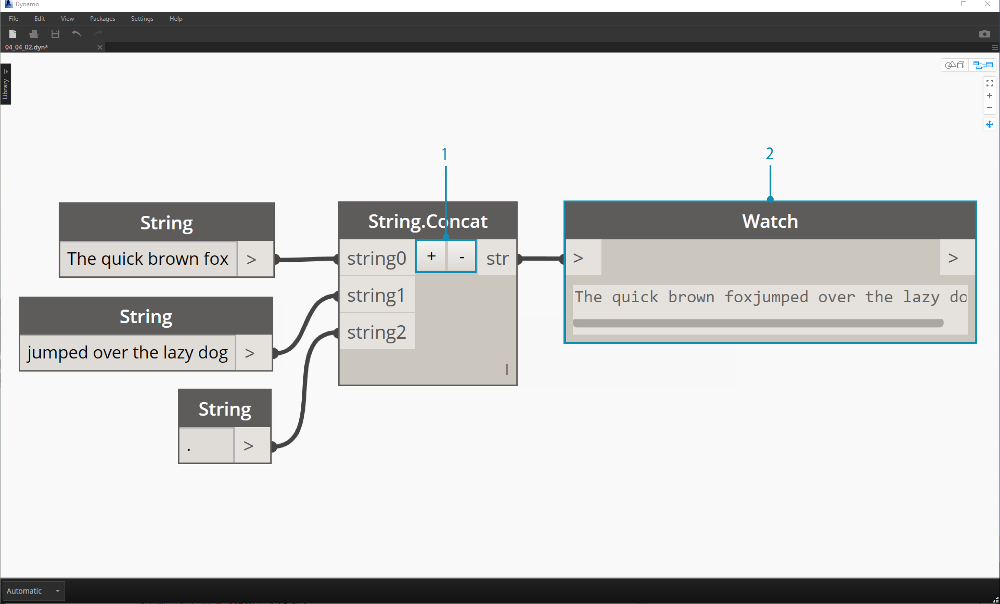
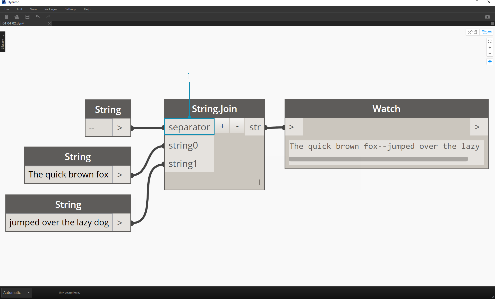
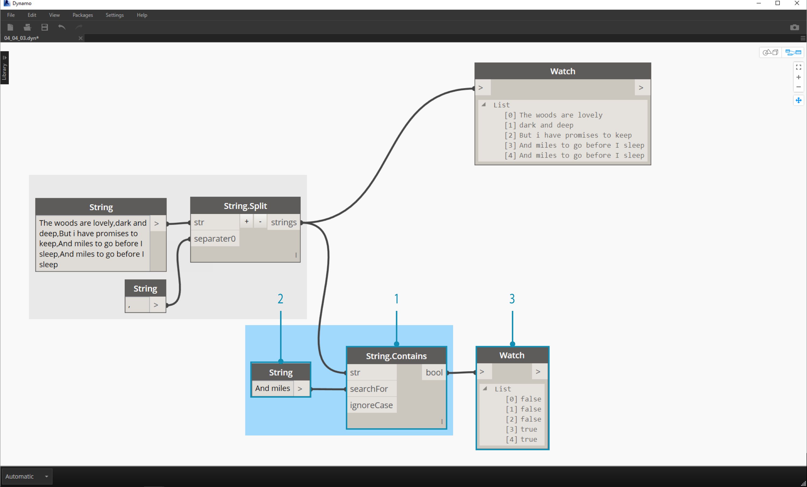

##Strings   字符串  
Formally, a **String** is a sequence of characters representing a literal constant or some type of variable. Informally, a string is programming lingo for text.  We've worked with numbers, both integers and decimal numbers, to drive parameters and we can do the same with text.\

形式上,**字符串**是一个字符序列代表一个文字常量或某种类型的变量。非正式地,是编程术语文本字符串。我们曾与数字,整数和小数,驱动参数和我们可以做同样的文本。

###Creating Strings    创建字符串
Strings can be used for a wide range of applications, including defining custom parameters, annotating documentation sets, and parsing through text-based data sets. The string Node is located in the Core>Input Category.

字符串可以用于各种各样的应用程序,包括定义自定义参数,注释文档集,通过基于文本的数据集和解析。字符串节点位于核心>输入类别。

> The sample Nodes above are strings.  A number can be represented as a string, as can a letter, or an entire array of text.

>上面的示例节点是字符串。数字可以表示为一个字符串,可以信,或整个数组的文本。
>

###Querying Strings   查询字符串
>Download the example file that accompanies this exercise (Right click and "Save Link As..."): [Building Blocks of Programs - Strings.dyn](datasets/4-5/Building Blocks of Programs - Strings.dyn). A full list of example files can be found in the Appendix.

>下载附带的示例文件这个练习(右点击“链接另存为…”):[构建模块的程序-字符串。达因)([Building Blocks of Programs - Strings.dyn](datasets/4-5/Building Blocks of Programs - Strings.dyn))。示例文件的完整列表可以在附录中找到。

You can parse through large amounts of data quickly by querying strings.  We'll talk about some basic operations which can speed up a workflow and help for software interoperability.

你可以通过大量数据的快速解析查询字符串。我们会讨论一些基本操作,可以加速一个工作流,帮助软件互操作性。

The image below considers a string of data coming from an external spreadsheet.  The string represents the vertices of a rectangle in the XY-Plane.  Let's break down some string split operations in miniature exercise:

下图认为一个字符串的数据来自外部的电子表格。该字符串代表一个矩形的顶点在xy平面。让我们打破一些字符串分割操作微型练习:

> 1. The ";" separator splits each vertex of the rectangle. This creates a list with 4 items for each vertex.

> 1。“；”分隔符分割每个顶点的矩形。这将创建一个列表为每个顶点4项。

> 1. By hitting the "*+*" in the middle of the Node, we create new separator.
2. Add a "*,*" string to the canvas and plug in to the new separator input.
3. Our result is now a list of ten items. The Node first splits based on *separator0*, then based on *separator1*.

> 1.按“* + *”中间的节点,我们创建新的分隔符。
> 
> 2.“* *”字符串添加到画布和插入到新的分隔符的输入。
> 
> 3.所示。我们现在的结果是十项的列表。基于* separator0 *第一节点分裂,然后基于* separator1 *。
> 

While the list of items above may look like numbers, they are still regarded as individual strings in Dynamo. In order to create points, their data type needs to be converted from a string to a Number. This is done with the String.ToNumber Node

虽然上面列出的物品可能看起来像数字,他们仍被视为在发电机单个字符串。为了创建点,其数据类型需要从一个字符串转换为一个数字。这是完成了的字符串。当时节点

> 1. This Node is straightforward.  Plug the String.Split results into the input.  The output doesn't look different, but the data type is now a *number* instead of a *string*.

> 1.这个节点是非常简单的。把字符串。结果分割成输入。输出看起来不不同,但数据类型是字符串*人数*不是* *.

> 1. With some basic additional operations, we now have a rectangle drawn at the origin based on the original string input.
> 

> 1。有额外的一些基本操作,我们现在有一个矩形绘制在原点基于原来的字符串输入。
> 

###Manipulating Strings    操纵字符串
Since a string is a generic text object, they host a wide range of applications.  Let's take a look at some of the major actions in the Core>String Category in Dynamo:

从一个字符串是一个通用的文本对象,他们举办一个广泛的应用程序。让我们看看一些主要的行动在发电机的核心类别>字符串:

This is a method of merging two strings together in order. This takes each literal string in a list and creates one merged string.

这是一个方法,将两个字符串合并在一起。这需要每个文字字符串列表和合并创建一个字符串。

> The image above represents the concatenation of three strings:
1. Add or subtract strings to the concatenation by clicking the +/- buttons int he center of the Node.
2. The output gives one concatenated string, with spaces and punctuation included.

>上图代表三个字符串的连接:
>
> 1.添加或减去字符串连接通过单击+ / -按钮int他的中心节点。
> 
> 2.输出为一个连接字符串,包括空格和标点符号。
> 

The join method is very similar to concatenate, except it has an added layer of punctuation.

连接方法连接非常相似,除了它有一个额外的层的标点符号。

If you've worked in Excel, you may have come across a CSV file.  This stands for comma-separated values.  One could use a comma (or in this case, two dashes) as the separator with the join Node in order to create a similar data structure:

如果你工作在Excel中,您可能会遇到一个CSV文件。这代表逗号分隔值。可以使用一个逗号(或在这种情况下,两个破折号)作为分隔符与加入节点以创建一个类似的数据结构:

> The image above represents the joining of two strings:
1. The separator input allows one to create a string which divides the joined strings.

>上图代表加入两个字符串:
1.分隔符的输入允许创建一个字符串,将加入字符串。

###Working with Strings   处理字符串
In this exercise, we're going to use methods of querying and manipulating strings to deconstruct the final stanza of Robert Frost's [Stopping By Woods on a Snowy Evening](http://www.poetryfoundation.org/poem/171621).  Not the most practical application, but it will help us to grasp conceptual string actions as we apply them to legible lines of rhythm and rhyme.

在这个练习中,我们将使用查询和操作字符串的方法来解构罗伯特·弗罗斯特的最后一节(阻止森林在一个下雪的晚上)([Stopping By Woods on a Snowy Evening](http://www.poetryfoundation.org/poem/171621).)。不是最实用的应用程序,但它可以帮助我们掌握概念的字符串操作我们将它们应用到清晰的节奏和韵律。

> Let's begin with a basic string split of the stanza.  We first notice that the writing is formatted based on commas.  We'll use this format to separate each line into individual items.
1. The base string is pasted into a string node.
2. Another string node is used to denote the separator.  In this case, we're using a comma.
3. A String.Split Node is added to the canvas and connected to the two strings.
4. The output shows that we've now separated the lines into individual elements.

>让我们从一个基本的字符串分割的节。我们首先注意到写作是根据逗号格式化。我们将使用这种格式分离成单独的每一行项目。
>
> 1.基本字符串粘贴到一个字符串节点。
> 
> 2.另一个字符串节点用来表示分离器。在本例中,我们使用一个逗号。
> 
> 3.所示。一个字符串。分裂节点添加到画布上,并连接到两个字符串。
> 
> 4.所示。输出显示,现在我们已经把线路分成单个元素。
> 

> Now, let's get to the good part of the poem: the last two lines.  The original stanza was one item of data.  We separated this data into individual items in the first step. Now we need to do a search for the text we're looking for. And while we *can* do this by selecting the last two items of the list, if this were an entire book, we wouldn't want to read through everything and manually isolate the elements.
1. Instead of manually searching, we use a String.Contains Node to perform a search for a set of characters.  This is the similar to doing the "Find" command in a word processor.  In this case, we get a return of "true" or "false" if that substring is found within the item.
2. In the "searchFor" input, we define a substring that we're looking for within the stanza. Let's use a string node with the text "And miles".
3. The output gives us a list of falses and trues.  We'll use this boolean logic to filter the elements in the next step.

> 现在,让我们好诗的一部分:最后两行。最初的节是一个项目的数据。我们分开这个数据到个人物品在第一步。现在我们需要做一个搜索文本我们正在寻找。当我们* *可以通过选择列表的最后两项,如果这是一整本书,我们不想阅读一切和手动隔离元素。
> 
> 1.而不是手动搜索,我们使用一个字符串。包含一组的节点来执行搜索的字符。这是类似于做“查找”命令在一个文字处理器。在这种情况下,我们会返回“true”或“false”如果找到子字符串内的项目。
> 
> 2.在“searchFor”输入,我们定义了一个节内的子串,我们正在寻找。让我们用一个字符串和文本节点”和英里”。
> 
> 3.所示.输出给我们假的列表和事实。我们将使用此布尔逻辑滤波器在下一步的元素。
> 

>1. List.FilterByBoolMask is the Node we want to use to cull out the falses and trues.  The "in" output return the statements with a "mask" input of "true, while the "out" output return those which are "false".
2. Our output from the "in" is as expected, giving us the final two lines of the stanza.

> 1.列表。FilterByBoolMask节点我们想用假和真。“在“输出返回语句的“面具”输入“真实,”“输出返回那些“错误”。
> 
> 2.我们的输出如预期的那样,“在”给我们的最后两行诗节。
> 

>Now, we want to drive home the repetition of the stanza by merging the two lines together.  When viewing the output of the previous step, we notice that there are two items in the list:
1. Using two List.GetItemAtIndex Nodes, we can isolate the items using the values of 0 and 1 as the index input.
2. The output for each Node gives us, in order, the final two lines.

> 现在,我们想开车回家的重复节一起通过合并两行。查看前一步骤的输出时,我们注意到有两个项目在列表中:
> 
> 1.使用两个列表。GetItemAtIndex节点,我们可以隔离物品使用0和1的值作为索引输入。
> 
> 2.输出为每个节点给我们,,最后的两行。
> 

>To merge these two items into one, we use the String.Join Node:
1. After adding the String.Join Node, we notice that we need a separator.
2. To create the separator, we add a string node to the canvas and type in a comma.
3. The final output has merged the last two items into one.

>这两个项目合并到一个,我们使用字符串。加入节点:
>
> 1.后添加的字符串。加入节点,我们注意到,我们需要一个分隔符。
> 
> 2.创建分隔符,我们添加一个字符串节点到画布上,并输入一个逗号。
> 
> 3.所示。最终的输出最后两个项目合并成一个。
> 

This may seem like a lot of work to isolate the last two lines; and it's true, string operations often require some up front work.  But they are scalable, and they can be applied to large datasets with relative ease.  If you are working parametrically with spreadsheets and interoperability, be sure to keep string operations in mind.

这可能看起来像一个很多工作要隔离最后两行;的确,字符串操作往往需要一些预先的工作。但是他们是可伸缩的,他们可以相对轻松地应用于大型数据集。如果你工作参数化与电子表格和互操作性,一定要记住字符串操作。

