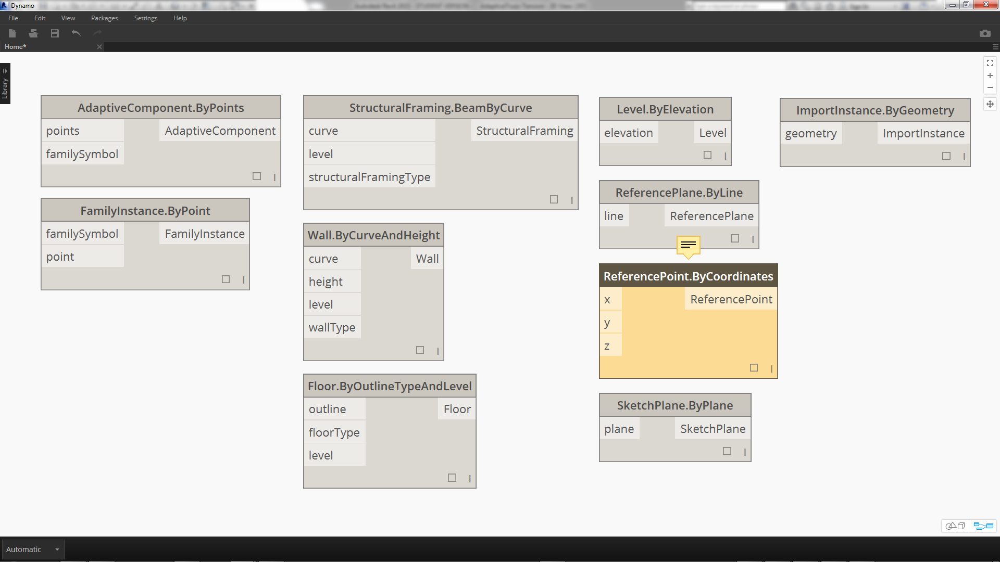
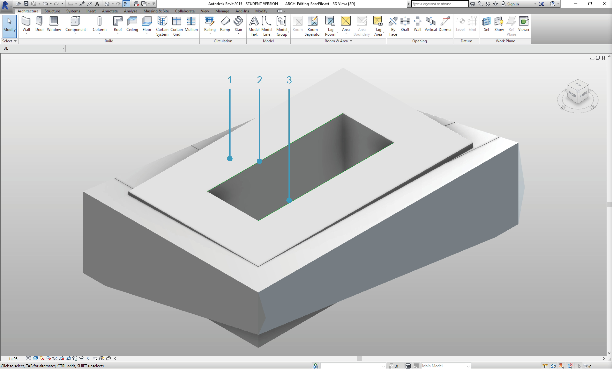
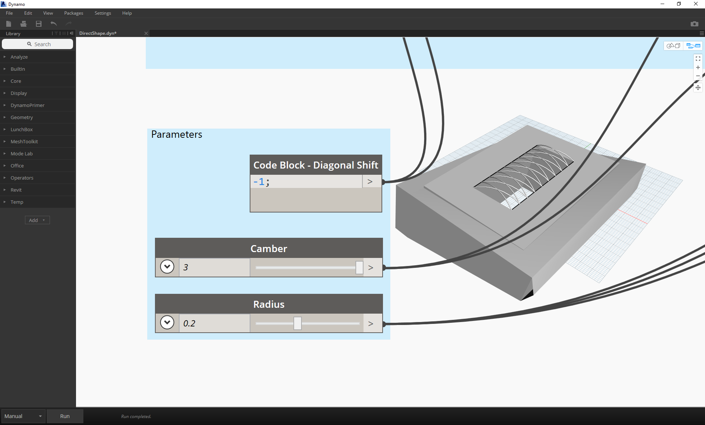

## Creating   Dynamo 创建 
You can create an array of Revit elements in Dynamo with full parametric control.  The Revit nodes in Dynamo offer the ability to import elements from generic geometries to specific category types (like walls and floors).  In this section, we'll focus on importing parametrically flexible elements with adaptive components.


您可以创建一个数组Revit元素在发电机的参数控制。Revit节点在发电机提供的能力进口来自通用的几何图形的元素特定类别类型(如墙壁和地板)。在本节中,我们将关注进口参数化与自适应组件灵活的元素。



### Adaptive Components    自适应组件
An adaptive component is a flexible family category which lends itself well to generative applications. Upon instantiation, you can create a complex geometric element which is driven by the fundamental location of adaptive points.


一种自适应组件是一个灵活的家庭类别,它非常适用于生成应用程序。在实例化之后,您可以创建一个复杂的几何元素是由自适应的基本位置点。


> An example of a three-point adaptive component in the family editor. This generates a truss which is defined by the position of each adaptive point.  In the exercise below, we'll use this component to generate a series of trusses across a facade.


> 一个家庭中的三点自适应组件编辑器。这生成一个桁架是由每个自适应点的位置。在下面的练习中,我们将使用这个组件来生成一系列正面桁架。
> 


#### Principles of Interoperability    互操作性的原则 
The adaptive component is a good example for best practices of interoperability.  We can create an array of adaptive components by defining the fundamental adaptive points.  And, when transferring this data to other programs, we have the ability to reduce the geometry to simple data.  Importing and exporting with a program like Excel follows a similar logic.

自适应组件互操作性的最佳实践就是一个很好的例子。我们可以创建一个数组的自适应组件通过定义基本自适应点。当将数据转移到其它项目,我们有能力减少几何简单的数据。导入和导出Excel类似这样的程序逻辑。


Suppose a facade consultant wants to know the location of the truss elements without needing to parse through fully articulated geometry.  In preparation for fabrication, the consultant can reference the location of adaptive points to regenerate geometry in a program like Inventor.


假设一个facade顾问想知道桁架元素的位置,而不需要通过周密的几何解析。在准备制造,顾问可以引用的位置自适应几何点再生等程序发明家。


The workflow we'll setup in the exercise below allows us to access all of this data while creating the definition for Revit element creation.  By this process, we can merge conceptualization, documentation, and fabrication into a seamless workflow.  This creates a more intelligent and efficient process for interoperability.


工作流我们将在下面的练习设置允许我们访问所有的数据在创建Revit元素的定义创建。通过这个过程,我们可以合并概念化,文档,制作成一个无缝的工作流程。这将创建一个更聪明和高效的流程互操作性。


#### Multiple Elements and Lists    多个元素和列表


The exercise below will walk through how Dynamo references data for Revit element creation.  To generate multiple adaptive components, we define a list of lists, where each list has three points representing each point of the adaptive component.  We'll keep this in mind as we manage the data structures in Dynamo.


下面的练习将穿过发电机如何引用Revit元素创建的数据。生成多个自适应组件,我们定义了一个列表的列表,每个列表中有三个点代表每个点的自适应组件。我们将牢记这一点,我们在发电机管理的数据结构。


### Exercise
> Download the example files that accompanies this exercise (Right click and "Save Link As..."). A full list of example files can be found in the Appendix.

>下载示例文件,伴随这个练习(右点击“链接另存为…”)。示例文件的完整列表可以在附录中找到。

1. [Creating.dyn](datasets/8-4/Creating.dyn)
2. [ARCH-Creating-BaseFile.rvt](datasets/8-4/ARCH-Creating-BaseFile.rvt)


> Beginning with the example file from this section (or continuing with the Revit file from the previous session), we see the same Revit mass.
1. This is the file as opened.
2. This is the truss system we'll created with Dynamo, linked intelligently to the Revit mass.

> 开始从本节的例子文件(或前一交易日继续Revit文件),我们看到相同的Revit质量。
> 
> 1.这是文件打开。
> 
> 2.这是桁架系统我们将创建发电机,有关智能Revit质量。


> We've used the *"Select Model Element"* and *"Select Face"* nodes, now we're taking one step further down in the geometry hierarchy and using *"Select Edge"*.  With the Dynamo solver set to run *"Automatic"*, the graph will continually update to changes in the Revit file. The edge we are selecting is tied dynamically to the Revit element topology.  As long as the topology* does not change, the connection remains linked between Revit and Dynamo.
1. Select the top most curve of the glazing facade.  This spans the full length of the building.  If you're having trouble selecting the edge, remember to choose the selection in Revit by hovering over the edge and hitting *"Tab"* until the desired edge is highlighted.
2. Using two *"Select Edge"* nodes, select each edge representing the cant at the middle of the facade.
3. Do the same for the bottom edges of the facade in Revit.
4. The *Watch* nodes reveal that we now have lines in Dynamo.  This is automatically converted to Dynamo geometry since the edges themselves are not Revit elements.  These curves are the references we'll use to instantiate adaptive trusses across the facade.


> 我们使用*选择模型元素“* *”选择面临“*节点,现在我们将更进一步的几何结构和使用*选择边缘”*。与发电机解算器设置为“自动”运行* *,图表将不断更新变化Revit文件。我们选择与动态边缘Revit元素拓扑。只要不改变拓扑*,仍然联系Revit和发电机之间的连接。
> 
>1。选择最重要的玻璃立面的曲线。这个建筑的完整。如果你难以选择,记住选择选择Revit在边缘徘徊,打*“选项卡”*,直到所需的边缘突出显示。
> 
>2。使用“选择边缘”两个* *节点,选择每条边代表不能在正面的中间。
> 
>3所示。做同样的在Revit底边的外观。
> 
>4所示。*注意*节点显示,我们现在有在发电机。这是自动转化为发电机几何自边缘本身并不是Revit元素。我们将使用这些曲线是引用实例化自适应桁架在正面。


**Note - to keep a consistent topology, we're referring to a model that does not have additional faces or edges added.  While parameters can change its shape, the way it which it is built remains consistent.*

**注意:拓扑保持一致,我们指的是一个模型,没有额外的面孔或边缘补充道。虽然参数可以改变它的形状,它是建立保持一致。*


> We first need to join the curves and merge them into one list.  This way we can *"group"* the curves to perform geometry operations.
1. Create a list for the two curves at the middle of the facade.
2. Join the two curves into a Polycurve by plugging the *List.Create* component into a *Polycurve.ByJoinedCurves* node.
3. Create a list for the two curves at the bottom of the facade.
4. Join the two curves into a Polycurve by plugging the *List.Create* component into a *Polycurve.ByJoinedCurves* node.
5. Finally, join the three main curves (one line and two polycurves) into one list.


> We want to take advantage of the top curve, which is a line, and represents the full span of the facade.  We'll create planes along this line to intersect with the set of curves we've grouped together in a list.
1. With a *code block*, define a range using the syntax: ```0..1..#numberOfTrusses;
```
2. Plug an *integer slider *into the input for the code block.  As you could have guessed, this will represent the number of trusses. Notice that the slider controls the number of items in the range defined from *0 *to *1*.
3. Plug the *code block* into the *param* input of a *"Curve.PlaneAtParameter"* node, and plug the top edge into the *curve* input.  This will give us ten planes, evenly distributed across the span of the facade.

> 我们想利用顶部的曲线,是一条直线,代表整个立面的跨度。我们将创建飞机沿着这条线相交曲线的设置我们列表中组合在一起。
> 1。*代码块*,使用语法:定义一系列的“0 . . 1 . . # numberOfTrusses;```
> 
> 2。一个*整数滑块*插入代码块的输入。正如你可能已经猜到了,这将代表桁架的数量。注意,滑块控制物品的数量定义的范围从0 * * 1 * *。
> 
> 3所示。代码块* *插入* * *”的输入参数曲线。PlaneAtParameter“*节点和边缘顶部插入* *输入曲线。这将给我们十架飞机,均匀地分布在facade张成的空间。


> A plane is an abstract piece of geometry, representing a two dimensional space which is infinite.  Planes are great for contouring and intersecting, as we are setting up in this step.
1. Using the *Geometry.Intersect* node, plug the *Curve.PlaneAtParameter* into the *entity* input of the *Geometry.Intersect* node.  Plug the main *List.Create* node into the *geometry* input.  We now see points in the Dynamo viewport representing the intersection of each curve with the defined planes.

> 一块平面是一个抽象的几何图形,代表一个二维空间是无限的。飞机的轮廓和相交,我们是建立在这一步。
> 
> 1。使用*几何。*节点相交,塞*曲线。PlaneAtParameter *的*实体*输入*几何学。*相交节点。塞的主要*列表。创建* *几何*输入节点。我们现在看到的发电机视窗代表每个曲线的交点与定义的飞机。


> Notice the output is a list of lists of lists. Too many lists for our purposes.  We want to do a partial flatten here.  We need to take one step down on the list and flatten the result.  To do this, we use the *List.Map* operation, as discussed in the list chapter of the primer.
1. Plug the *Geometry.Intersect* node into the list input of *List.Map*.
2. Plug a *Flatten* node into the f(x) input of *List.Map*.  The results gives 3 list, each with a count equal to the number of trusses.
3. We need to change this data. If we want to instantiate the truss, we have to use the same number of adaptive points as defined in the family.  This is a three point adaptive component, so instead of three lists with 10 items each (numberOfTrusses), we want 10 lists of three items each.  This way we can create 10 adaptive components.
3. Plug the *List.Map* into a *List.Transpose* node.  Now we have the desired data output.
4. To confirm that the data is correct, add a *Polygon.ByPoints* node to the canvas and double check with the Dynamo preview.

> 注意输出列表的列表的列表。太多的列表对于我们的目的。我们想做一个部分变平。我们需要采取一个步骤和结果列表。为此,我们使用*列表。地图*操作,作为底漆的列表一章中讨论。
> 
> 1。塞*几何学。*相交节点的列表输入* List.Map *。
> 
> 2。*平*节点插入的f(x)输入* List.Map *。结果给出了3列表,每一个都有计数等于桁架的数量。
> 
> 3所示。我们需要改变这些数据。如果我们想要实例化桁架,我们必须使用相同数量的自适应分中定义的家庭。这是一个三分的自适应组件,而不是三个列表10项(numberOfTrusses),我们希望十三项每个列表。这样我们可以创建10个自适应组件。
> 
> 3所示。塞*列表。地图* *列表。转置*节点。现在我们有了所需的数据输出。
> 
> 4所示。确认数据是正确的,添加一个多边形。ByPoints *节点到画布上,仔细检查发电机预览。


> In the same way we created the polygons, we array the adaptive components.
1. Add an *AdaptiveComponent.ByPoints* node to the canvas, plug the *List.Transpose* node into the *points* input.
2. Using a *Family Types* node, select the *"AdaptiveTruss"* family, and plug this into the *familySymbol* input of the *AdaptiveComponent.ByPoints* node.

> 以相同的方式创建多边形,我们阵列自适应组件。
> 
> 1。添加一个* AdaptiveComponent。ByPoints *节点到画布上,塞*列表。转置* *点*输入节点。
> 
> 2。使用* *家庭类型节点,选择*“AdaptiveTruss”*家族,这插入* familySymbol * * AdaptiveComponent的输入。ByPoints *节点。


> Checking in Revit, we now have the ten trusses evenly spaced across the facade!

> 检查Revit,我们现在有十个桁架等间距的整个外观!


> 1. "Flexing" the graph, we turn up the *numberOfTrusses* to *40* by changing the *slider*.  Lots of trusses, not very realistic, but the parametric link is working.

>  1.“弯曲”图,我们把* numberOfTrusses * * 40 *通过改变滑块* *。大量的桁架,不是很现实,但是参数链接工作。


> 1. Taming the truss system, let's compromise with a value of *15* for *numberOfTrusses*.

> 1.驯服桁架系统,让我们妥协* 15 * * numberOfTrusses *的价值.


> And for the final test, by selecting the mass in Revit and editing instance parameters, we can change the form of the building and watch the truss follow suit.  Remember, this Dynamo graph has to be open in order to see this update, and the link will be broken as soon as it's closed.


> 在最后的测试中,通过选择质量Revit和编辑实例参数,我们可以改变建筑的形式和观看桁架效仿。记住,这发电机图必须开放为了看到这个更新,和链接将被尽快的关闭。


### DirectShape Elements    DirectShape元素
Another method for importing parametric Dynamo geometry into Revit is with DirectShape. In summary, the DirectShape element and related classes support the ability to store externally created geometric shapes in a Revit document. The geometry can include closed solids or meshes. DirectShape is primarily intended for importing shapes from other data formats such as IFC or STEP where not enough information is available to create a "real" Revit element.  Like the IFC and STEP workflow, the DirectShape functionality works well with importing Dynamo created geometries into Revit projects as real elements. 

另一个方法参数发电机几何导入Revit DirectShape。总之,DirectShape元素和相关类支持能力Revit文档中存储外部创建几何图形。几何可以包括关闭固体或网格。DirectShape主要是用于从其他数据格式,如国际金融公司进口形状或步骤,没有足够的信息来创建一个“真正的”Revit元素。IFC和工作流,步DirectShape功能适用与发电机创建几何图形导入Revit项目真正的元素。


Let's walk through and exercise for importing Dynamo geometry as a DirectShape into our Revit project. Using this method, we can assign an imported geometry's category, material, and name - all while maintaining a parametric link to our Dynamo graph.


让我们穿过进口发电机几何和运动作为DirectShape Revit项目。使用这种方法,我们可以分配一个进口几何的类别,材料,和名称,同时保持参数链接到我们的发电机图。


### Exercise
> Download the example files that accompanies this exercise (Right click and "Save Link As..."). A full list of example files can be found in the Appendix.
1. [DirectShape.dyn](datasets/8-4/DirectShape.dyn)
2. [ARCH-DirectShape-BaseFile.rvt](datasets/8-4/ARCH-DirectShape-BaseFile.rvt)


> Begin by opening the sample file for this lesson - ARCH-DirectShape-BaseFile.rvt.
1. In the 3D view, we see our building mass from the previous lesson.
2. Along the edge of the atrium is one reference curve, we'll use this as a curve to reference in Dynamo.
3. Along the opposing edge of the atrium is another reference curve which we'll reference in Dynamo as well.

> 首先开放这一课——ARCH-DirectShape-BaseFile.rvt的示例文件。
> 
> 1。在三维视图中,我们可以看到我们的建筑质量从先前的教训。
> 
> 2。沿着边缘的中庭是一个参考曲线,我们将使用这个作为参考曲线在发电机。
> 
> 3所示。在对方的心房是另一个参考曲线我们参考在发电机。
> 


>1. To reference our geometry in Dynamo, we'll use *Select Model Element* for each member in Revit. Select the mass in Revit and import the geometry into Dynamo by Using *Element.Faces* - the mass should now be visible in your Dynamo preview.
2. Import one reference curve into Dynamo by using *Select Model Element* and *CurveElement.Curve*.
3. Import the other reference curve into Dynamo by using *Select Model Element* and *CurveElement.Curve*.

> 1。引用我们在发电机的几何,我们将使用*选择模型元素* Revit的每个成员。选择Revit质量和几何图形导入发电机用*元素。现在可以看见脸*——质量发电机预览。
> 
> 2。一个引用曲线导入发电机用* *和* CurveElement.Curve *选择模型元素。
> 
> 3所示。其他参考曲线导入发电机用* *和* CurveElement.Curve *选择模型元素。
> 



>1. Zooming out and panning to the right in the sample graph, we see a large group of nodes - these are geometric operations which generate the trellis roof structure visible in the Dynamo preview.  These nodes are generating using the *Node to Code* functionality as discussed in the [code block section](../07_Code-Block/7-2_Design-Script-syntax.md#Node) of the primer.
2. The structure is driven by three major parameters - Diagonal Shift, Camber, and Radius.

> 1。缩放和移动到右边的样品图,我们看到一大群节点——这些都是几何操作生成格子屋顶结构可见的发电机预览。这些节点使用* *节点代码生成功能的讨论(代码块部分)[code block section](../07_Code-Block/7-2_Design-Script-syntax.md#Node)的底漆。
> 
> 2。结构是由三个主要参数——对角线转变,外倾,半径。
> 



>Zooming a close-up look of the parameters for this graph.  We can flex these to get different geometry outputs.

> 缩放的特写镜头看这个图的参数。我们可以flex这些不同的几何图形输出。


>1. Dropping the *DirectShape.ByGeometry* node onto the canvas, we see that it has four inputs: **geometry, category, material**, and **name**.
2. Geometry will be the solid created from the geometry creation portion of the graph
3. The category input is chosen using the dropdwon *Categories* node. In this case we'll use "Structural Framing".
4. The material input is selected through the array of nodes above - although it can be more simply defined as "Default" in this case.


>After running Dynamo, back in Revit, we have the imported geometry on the roof in our project. This is a structural framing element, rather than a generic model.  The parametric link to Dynamo remains intact.


>1. If we "flex" the Dynamo graph by changing the "Diagonal Shift" parameter to "-2", we just run Dynamo again and get a new imported DirectShape!