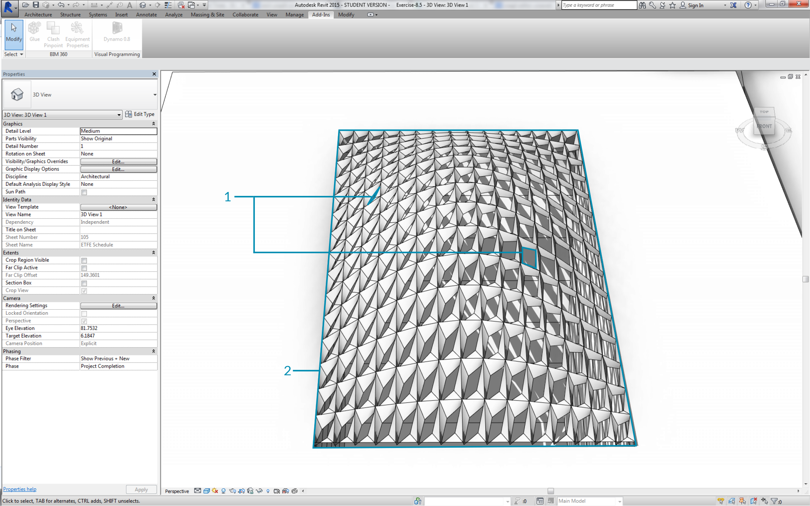
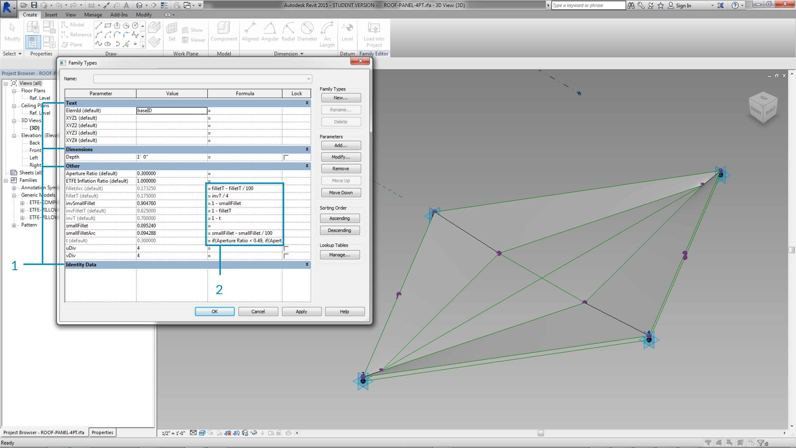
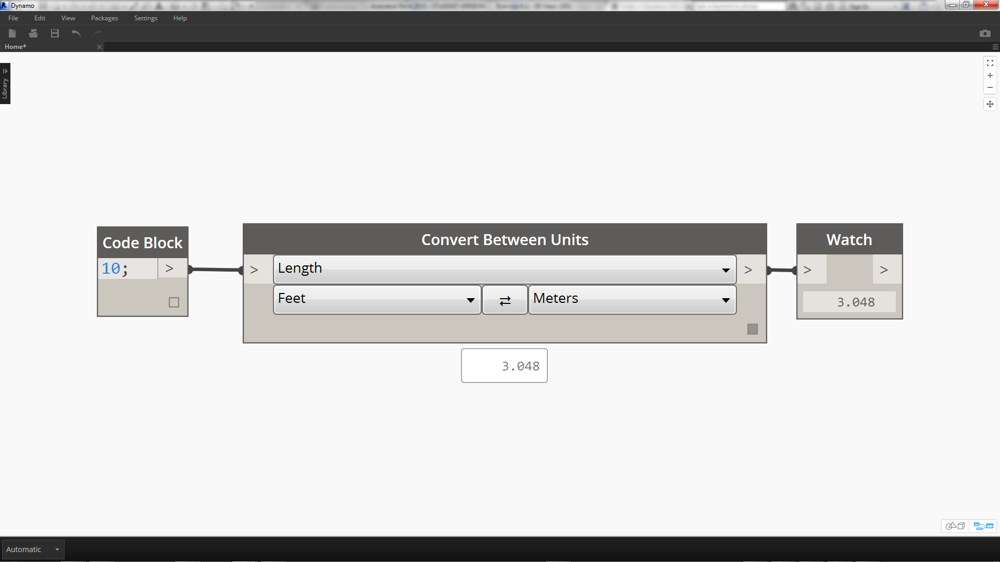
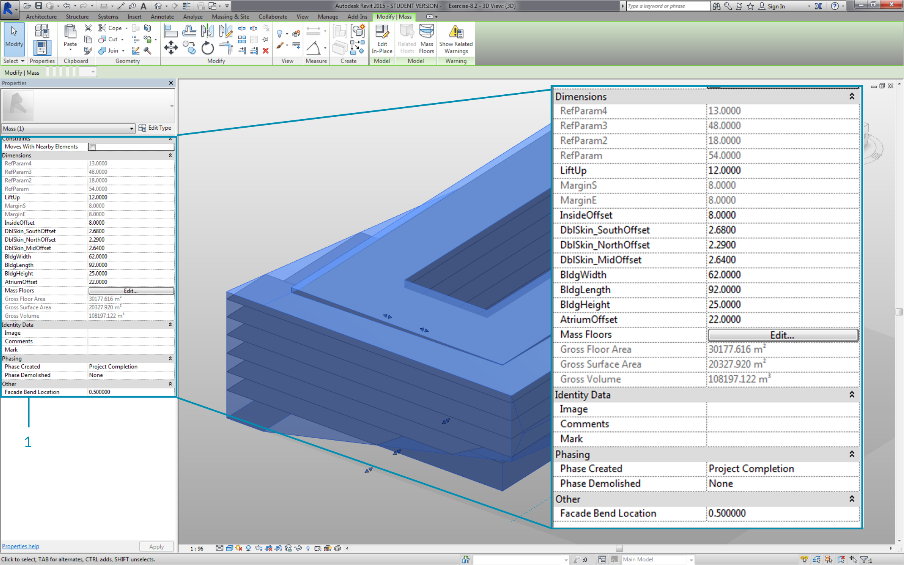
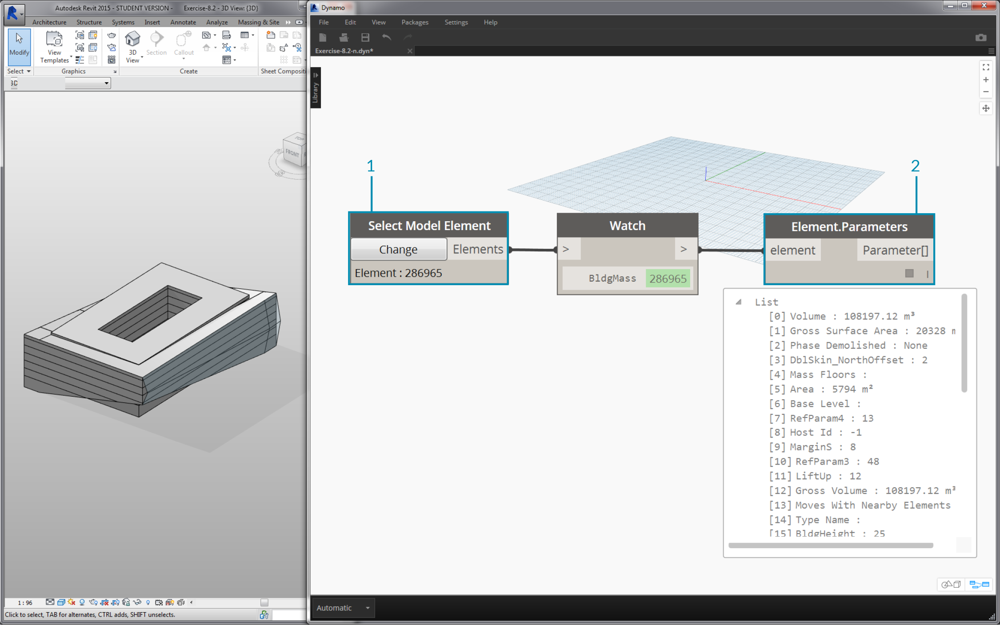
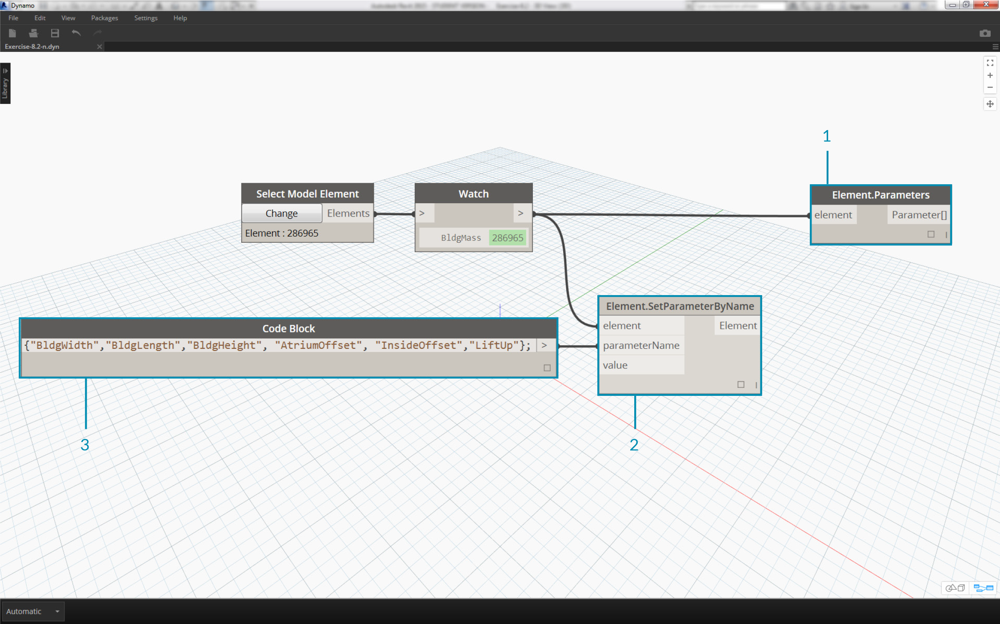
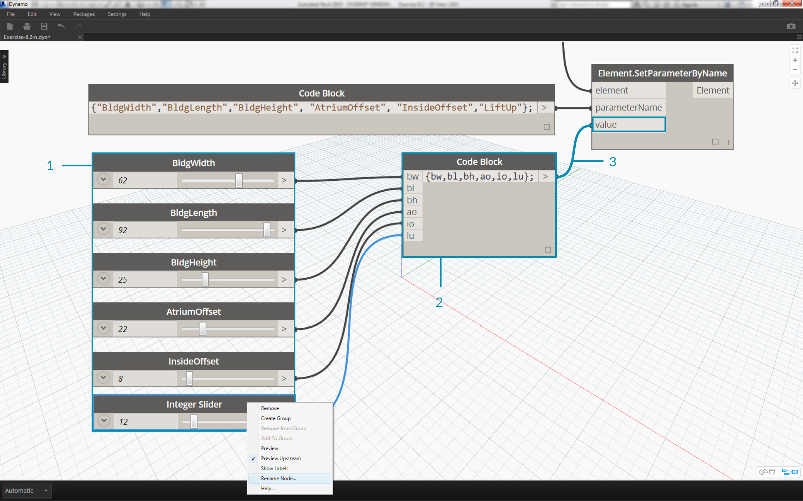
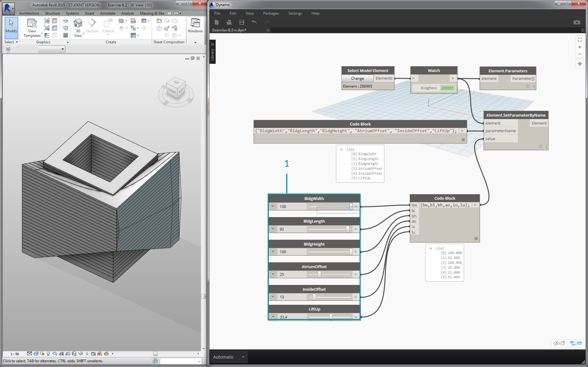
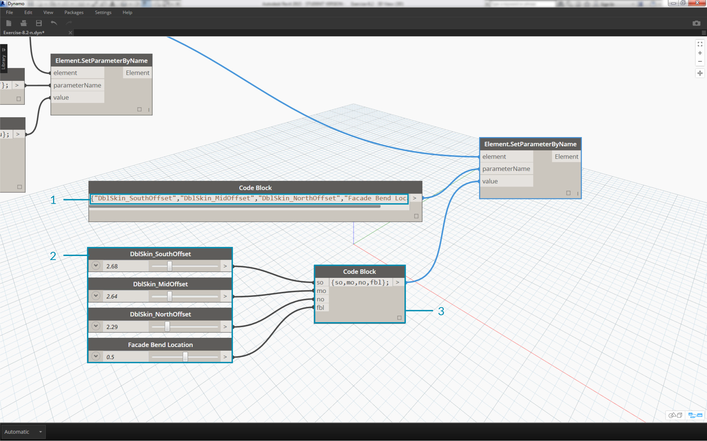
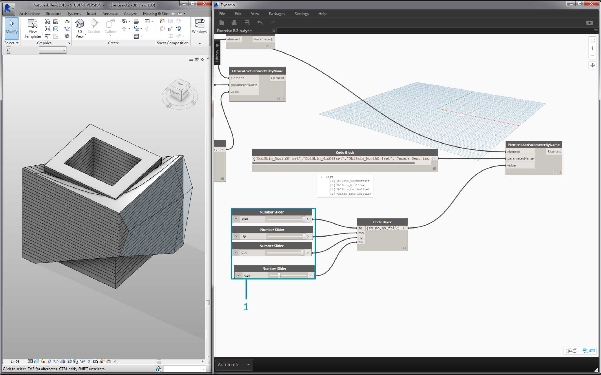

## Editing   编辑
A powerful feature of Dynamo is that you can edit parameters on a parametric level.  For example, a generative algorithm or the results of a simulation can be used to drive the parameters of an array of elements. This way, a set of instances from the same family can have custom properties in your Revit project.

发电机的一个强大特性是您可以编辑参数对参数的水平。例如,生成算法或模拟的结果可用于驱动的参数的数组元素。这样,一组实例来自同一个家庭Revit项目中的自定义属性。

### Type and Instance Parameters     类型和实例参数  

> 1. Instance parameters define the aperture of the panels on the roof surface, ranging from an Aperture Ratio of 0.1 to 0.4.
2. Type-based parameters are applied to every element on the surface because they are the same family type.  The material of each panel, for example,  can be driven by a type-based parameter.


> 1.实例参数定义的屋顶太阳能板表面的孔径,从0.1到0.4的孔径比.
> 
> 2.基于类型参数应用于表面上的每一个元素,因为他们是相同的家庭类型。每个面板的材料,例如,可以由一个基于类型参数.



>1. If you've set up a Revit family before, remember that you have to assign a parameter type (string, number, dimension, etc.) Be sure to use the correct data type when assigning parameters from Dynamo.
2. You can also use Dynamo in combination with parametric constraints defined in a Revit family's properties.


> 1.Revit家庭之前,如果你建立了一个记住,你必须指定参数类型(字符串、数字、尺寸、等)时一定要使用正确的数据类型分配从发电机参数.
> 
> 2.您还可以使用发电机结合参数约束定义在一个Revit家族的属性.
> 


As a quick review of parameters in Revit, we recall that there are type parameters and instance parameters.  Both can be edited from Dynamo, but we'll work with instance parameters in the exercise below. 

作为参数的快速回顾Revit,我们回想一下,有类型参数和实例的参数。从发电机都可以编辑,但是我们将使用实例参数在下面的练习。


Note: As you discover the wide-reaching application of editing parameters, you may want to edit a large quantity of elements in Revit with Dynamo.  This can be a *computationally expensive* operation, meaning that it can be slow. If you're editing a large number of elements, you may want to use the "freeze" node functionality in order to pause the execution of Revit operations while you develop your graph. For more information on freezing nodes, check out the "Freezing" section in the [solids chapter](../05_Geometry-for-Computational-Design/5-6_solids.md#freezing).


注意:当你发现编辑参数的深远的应用程序,您可能需要编辑大量的元素在Revit发电机。这可能是一个* *操作计算昂贵,这意味着它可以缓慢。如果你编辑大量的元素,您可能想要使用“冻结”节点功能以暂停执行Revit操作当你发展你的图。冻结节点上的更多信息,查看“冻结”一节中(固体章)[solids chapter](../05_Geometry-for-Computational-Design/5-6_solids.md#freezing).


#### Units   单位
As of version 0.8, Dynamo is fundamentally unitless.  This allows Dynamo to remain an abstract visual programming environment. Dynamo nodes that interact with Revit dimensions will reference The Revit project's units.  For example, if you are setting a length parameter in Revit from Dynamo, the number in Dynamo for the value will correspond to the default units in the Revit project.  The exercise below works in meters.

从版本0.8开始,发电机根本上是没有单位的。这允许发电机是一个抽象的可视化编程环境。发电机节点与Revit维度将参考Revit项目的单位。举个例子,如果你设置长度参数Revit从发电机,发电机的数量值将对应默认单位Revit项目。下面的练习在米工作。



> For a quick conversion of units, use the *"Convert Between Units"* node.  This is a handy tool for converting Length, Area, and Volume units on the fly.

> 快速转换单元,使用“单位”之间转换节点。这是一个方便的工具转换长度,面积,体积单位.


### Exercise
>Download the example files that accompanies this exercise (Right click and "Save Link As..."). A full list of example files can be found in the Appendix.


> 下载示例文件,伴随这个练习(右点击“链接另存为…”)。示例文件的完整列表可以在附录中找到.


1. [Editing.dyn](datasets/8-3/Editing.dyn)
2. [ARCH-Editing-BaseFile.rvt](datasets/8-3/ARCH-Editing-BaseFile.rvt)

This exercise focuses on editing Revit elements without performing geometric operation in Dynamo.  We're not importing Dynamo geometry here, just editing parameters in a Revit project.  This exercise is basic, and to the more advanced Revit users, notice that these are instance parameters of a mass, but the same logic can be applied to an array of elements to customize on a large scale. This is all done with the "Element.SetParameterByName" node.


这个练习专注于编辑Revit元素没有执行的几何操作发电机。我们没有进口发电机几何,编辑参数在Revit项目。这个练习是基本的和更高级的Revit用户,注意这些实例参数的质量,但同样的逻辑也适用于大规模定制的数组元素。这都是用“元素。SetParameterByName”节点。



> Begin with the example Revit file for this section.  We've removed the structural elements and adaptive trusses from the previous section.  In this exercise, we will focus on a parametric rig in Revit and manipulating in Dynamo.
1. Selecting the building in Mass in Revit, we see an array of instance parameters in the properties panel.


> 从本节的例子Revit文件开始。我们已经删除了前一节的结构元素和自适应桁架。在这个练习中,我们将关注发电机参数Revit和操作平台.
> 
>1.选择建筑质量Revit,我们看到在properties面板实例数组参数。
>



> 1. Select the building mass with the *"Select Model Element"* node.
2. We can query all of the parameters of this mass with the *"Element.Parmaters"* node.  This includes type and instance parameters.


> 1.选择建筑质量与* *节点选择模型元素.
> 
> 2.我们可以查询所有的参数的这个质量*”元素。Parmaters“*节点。这包括类型和实例的参数.
> 



> 1. Reference the *Element.Parameters* node to find target parameters.  Or, we can view the properties panel from the previous step to choose which parameter names we want to edit.  In this case, we are looking for the parameters which affect the large geometric moves on the building mass.
2. We will make changes to the Revit element using the *Element.SetParameterByName* node.
3. Using the *code block*, we define a list of these parameters, with quotes around each item to denote a string.  We can also use the List.Create node with a series of *"string"* nodes connected to multiple inputs.  Code block is simply faster and easier.  Just make sure that the string matches the exact name in Revit, case-specific:  ```{"BldgWidth","BldgLength","BldgHeight", "AtriumOffset", "InsideOffset","LiftUp"};
```

> 1.*元素的引用.参数*节点找到目标参数.或者,我们可以查看properties面板从上一步选择参数名称我们想编辑.在这种情况下,我们正在寻找参数影响大几何继续建设质量.
> 
> 2.我们将更改Revit元素使用*元素.SetParameterByName *节点.
> 
> 3所示.代码块使用* *,我们定义这些参数的列表,每个条目与引号来表示一个字符串.我们还可以使用列表.创建节点与一系列的“字符串”* *节点连接到多个输入.代码块是更快和更容易.只是确保字符串匹配的名字在Revit,作用:“{”BldgWidth”、“BldgLength”,“BldgHeight”、“AtriumOffset”、“InsideOffset”、“LiftUp”};
' ' '



> 1. We also want to designate values for each parameter.  Add six *"integer sliders"* to the canvas and rename to the corresponding parameter in the list.  Also, set the values of each slider to the image above.  In order from top-to-bottom: ```62,92,25,22,8,12
```
2. Define another *code block* with a list of the same length as the parameter names.  In this case, we name variables (without quotes) which create inputs for the *code block.*  Plug the *sliders* into each respective input: ```{bw,bl,bh,ao,io.lu};
```
3. Connect the *code block *to the *"Element.SetParameterByName*"* node.  With run automatically checked, we will automatically see results.

> 1.我们也想为每个参数指定值。6 *“整数滑块”*添加到画布和重命名列表中相应的参数。此外,每个滑块的值设置为上面的图像。从自上而下为:“62年,92年,25日,22日,8、12   ' ' '
> 
>2.定义另一个代码块* *长度相同的列表作为参数名称。在这种情况下,我们的名字变量(没有引号)为*创建输入代码块。* *滑块*插入每个各自的输入:“‘{ bw、提单、黑洞、ao io.lu };   ' ' '
>
>3所示.连接*代码块* *”元素。SetParameterByName * *”节点。与自动运行检查,我们会自动看到结果。


**Note - this demonstration works with instance parameters, but not type parameters.*


**注意:这个演示使用实例参数,但不是类型参数。*



Just as in Revit, many of these parameters are dependent on each other.  There are of course combinations where the geometry may break.  We can remedy this issue with defined formulas in the parameter properties, or we can setup a similar logic with math operations in Dynamo (this is an additional challenge if you'd like to expand on the exercise).
> 1. This combination gives a funky new design to the building mass: ```100,92,100,25,13,51.4
```

就像在Revit,许多这些参数相互依赖。当然组合的几何可能打破。我们可以解决这个问题的定义公式参数属性,或者我们可以设置一个类似的逻辑与数学操作发电机(这是一个额外的挑战,如果你想拓展运动)。


> 1.这种组合提供了一个时髦的新设计的建筑质量:““100,92100,25日,13日,51.4
```



> 1. Let's copy the graph and focus on the facade glazing which will house the truss system.  We isolate four parameters in this case: ``` {"DblSkin_SouthOffset","DblSkin_MidOffset","DblSkin_NorthOffset","Facade Bend Location"};
```
2. Additionally, we create *number sliders* and rename to the appropriate parameters.  The first three sliders from top-to-bottom should be remapped to a domain of [0,10], while the final slider, *"Facade Bend Location"*, should be remapped to a domain of [0,1].  These values, from top-to-bottom should start with these values (although they're arbitrary): ```2.68,2.64,2.29,0.5
```

> 1。复制图形和关注立面玻璃房子桁架体系。在这种情况下我们分离四个参数:‘‘{“DblSkin_SouthOffset”、“DblSkin_MidOffset”,“DblSkin_NorthOffset”、“表面弯曲位置”};


3. Define a new *code block *and connect the sliders: ```{so,mo,no,fbl};
```

3所示。定义一个新的* *代码块和连接滑块:“‘{莫,不,fbl };
' ' '



> 1. By changing the *sliders* in this part of the graph, we can make the facade glazing much more substantial: ```9.98,10.0,9.71,0.31
```

> 1。通过改变*滑块*在这个图的一部分,我们可以使立面玻璃更实质性的:“‘9.98,10.0,9.71,0.31


