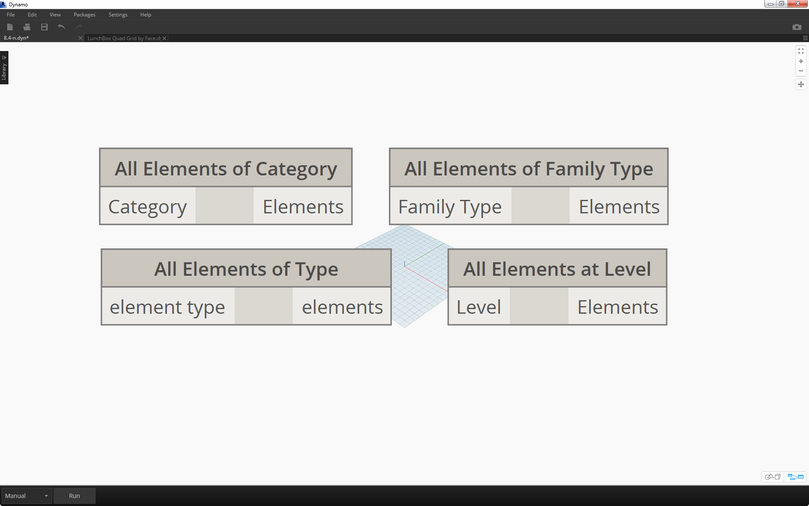
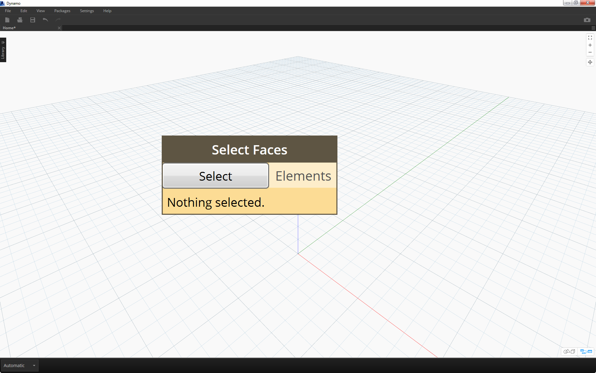
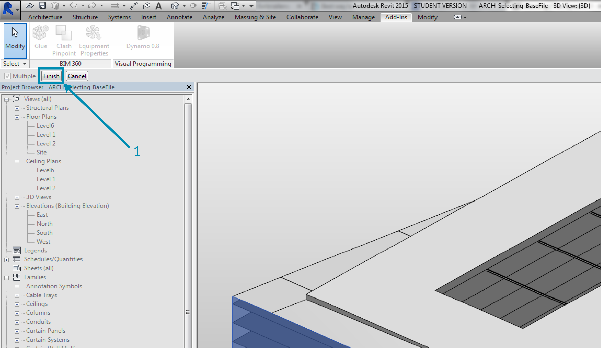

## Selecting   选择
Revit is a data-rich environment.  This gives us a range of selection abilities which expands far beyond "point-and-click".  We can query the Revit database and dynamically link Revit elements to Dynamo geometry while performing parametric operations.


Revit是一个丰富的数据环境。这给了我们一系列的选择能力的扩张远远超出“单击”。我们可以查询Revit数据库和动态链接Revit元素执行参数操作时电机几何。


> The Revit library in the UI offers a "Selection" category which enables multiple ways to select geometry.

> Revit图书馆在UI中提供了一个“选择”类别使多种方式选择几何。


To select Revit elements properly, it's important to have a full-understanding of the Revit element hierarchy. Want to select all the walls in a project? Select by category.  Want to select every Eames chair in your mid-century modern lobby? Select by family.  Before jumping into an exercise, let's do a quick review of the Revit hierarchy.


正常选择Revit元素,重要的是要有一个充分理解Revit元素的层次结构。项目中要选择所有的城墙?选择按类别。要选择每个埃姆斯椅在本世纪中叶现代游说?选择家庭。在跳入一个练习之前,让我们做一个快速回顾Revit层次结构。


#### Revit Hierarchy   Revit层次结构


Remember the taxonomy from Biology? Kingdom, Phylum, Class, Order, Family, Genus, Species? Revit elements are categorized in a similar manner.  On a basic level, the Revit hierarchy can be broken down into Categories, Families, Types*, and Instances.  An instance is an individual model element (with a unique ID) while a category defines a generic group (like "walls" or "floors").  With the Revit database organized in this manner, we can select one element and choose all similar elements based on a specified level in the hierarchy.

还记得从生物学分类吗?王国、门、类、秩序、家庭、属,物种?Revit元素分类以类似的方式。在基本层面上,Revit层次结构可以分为类别,家庭类型*和实例。实例是一个单独的模型元素(一个惟一的ID),而一个类别定义了一个通用集团(如“墙”或“层”)。Revit数据库组织通过这种方式,我们可以选择一个元素并选择所有类似的元素根据指定的层次的。


**Note - Types in Revit are defined differently from types in programming.  In Revit, a type refers to a branch of the hierarchy, rather than a "data type".*


* *注意:类型Revit定义不同类型的编程。在Revit,指的是一种层次结构的一个分支,而不是一个“数据类型”。*


#### Database Navigation with Dynamo nodes     与发电机节点数据库导航
The three images below breakdown the main categories for Revit element selection in Dynamo. These are great tools to use in combination, and we'll explore some of these in the following exercises.


下面的三个图像分解的主要类别Revit元素选择发电机。这些都是伟大的工具结合使用,我们将探讨一些在接下来的练习。


> *Point-and-click* is the easiest way to directly select a Revit element.  You can select a full model element, or parts of its topology (like a face or an edge).  This remains dynamically linked to that Revit object, so when the Revit file updates its location or parameters, the referenced Dynamo element will update in the graph.


> *指向-点击*最简单的方法是直接选择一个Revit元素。您可以选择一个完整的模型元素,或部分的拓扑(像一张脸或优势)。这仍然是动态链接Revit对象,所以当Revit文件更新它的位置或参数,将更新图中引用的发电机的元素。
> 


> *Dropdown menus* create a list of all accessible elements in a Revit project.  You can use this to reference Revit elements which are not necessarily visible in a view.  This is a great tool for querying existing elements or creating new ones in a Revit project or family editor.

> *下拉菜单*创建一个列表的所有访问元素Revit项目。您可以使用此引用Revit元素不一定是一个视图中看到。这是一个很好的工具查询现有元素或者创建新的Revit项目或家庭编辑器。



> You can also select Revit elementy by specific tiers in the *Revit hierarchy*.  This is a powerful option for customizing large arrays of data in preparation for documentation or generative instantiation and customization.

>您还可以选择Revit elementy * * Revit特定层的层次结构。这是一个功能强大的选择定制大型数组中的数据准备文档或生成实例化和定制。


With the three images above in mind, let's dive into an exercise which selects elements from a basic Revit project in preparation for the parametric applications we'll create in the remaining sections of this chapter.


记住上面的三张图片,让我们深入的运动从一个基本的选择元素Revit项目在准备我们将创建的参数应用本章的剩余部分。


### Exercise
>Download the example files that accompanies this exercise (Right click and "Save Link As..."). A full list of example files can be found in the Appendix.

>下载示例文件,伴随这个练习(右点击“链接另存为…”)。示例文件的完整列表可以在附录中找到。


1. [Selecting.dyn](datasets/8-2/Selecting.dyn)
2. [ARCH-Selecing-BaseFile.rvt](datasets/8-2/ARCH-Selecting-BaseFile.rvt)


> In this example Revit file, we have three element types of a simple building.  We're going to use this as an example for selecting Revit elements within the context of the Revit hierachy:
1. Building Mass
2. Trusses (Adaptive Components)
3. Beams (Structural Framing)


> Revit文件,在本例中我们有三个元素的一个简单的建筑类型。我们要用这个作为一个例子Revit Revit层次元素的上下文中选择:
> 
> 1.建筑质量
> 
> 2.桁架(自适应组件)
> 
> 3.所示梁(结构框架)


> What conclusions can we draw from the elements currently in the Revit project view?  And how far down the hierarchy do we need to go to select the appropriate elements?  This will of course become a more complex task when working on a large project. There are a lot of options available: we can select elements by categories, levels, families, instances, etc.
1. Since we're working with a basic setup, let's select the building mass by choosing *"Mass"* in the Categories dropdown node.  This can be found in the Revit>Selection tab.
2. The output of the Mass category is just the category itself.  We need to select the elements.  To do this, we use the *"All Elements of Category"* node.
3. A *Watch* node reveals that we've selected the BldgMass.


> 我们可以得到什么结论Revit当前元素的项目视图?沿着层次结构和多远我们需要去选择适当的元素吗?这当然会成为一个更复杂的任务当工作在一个大型项目。有很多选择:我们可以通过类别,选择元素水平,家庭、实例等。  
> 
> 1.由于我们正在与一个基本设置,让我们选择建筑质量* *“质量”分类下拉框中选择节点。这可以发现在Revit >选择选项卡。
> 
> 2.的输出质量类别是类别本身。我们需要选择元素。为此,我们使用“类别的所有元素”节点。
> 
> 3.所示*注意*节点显示,我们选择了BldgMass。


At this point, notice that we don't see any geometry in Dynamo. We've selected a Revit element, but have not converted the element into Dynamo geometry.  This is an important separation.  If you were to select a large number of elements, you don't want to preview all of them in Dynamo because this would slow everything down.  Dynamo is a tool to manage a Revit project without necessarily performing geometry operations, and we'll look at that in the next section of this chapter.

在这一点上,请注意,我们没有看到任何几何形状的发电机。我们选择Revit元素,但没有几何元素转换成发电机。这是一个重要的分离。如果你选择大量的元素,你不想预览所有的发电机,因为这一切都慢下来。发电机是一个工具来管理一个Revit项目不必执行几何操作,我们会看看在这一章的下一部分。


In this case, we're working with simple geometry, so we want to bring the geometry into the Dynamo preview.  The "BldgMass" in  the watch node above has a green number* next to it.  This represents the element's ID and tells us that we are dealing with a Revit element, not Dynamo geometry.The next step is to convert this Revit element into geometry in Dynamo.


在本例中,我们使用简单的几何图形,所以我们想把几何发电机预览。“BldgMass”在上面的表节点有一个绿色的数量*旁边。这表示元素的ID和告诉我们,我们正在处理一个Revit元素,不是电机几何。下一步是将这个Revit元素转化为几何在发电机。


> 1. Using the *Element.Faces* node, we get a list of surfaces representing each face of the Revit Mass.  We can now see the geometry in the Dynamo viewport and start to reference the face for parametric operations.


> 1。使用*元素。脸*节点,我们得到一个列表Revit代表每个面表面的质量。我们现在可以看到的几何发电机视窗并开始引用参数操作的脸。


> Here's an alternative method.  In this case, we're stepping away from selecting via the Revit Hierarchy *("All Elements of Category")* and electing to explicitly select geometry in Revit.
1.  Using the *"Select Model Element"* node, click the *"select" *(or *"change"*) button.  In the Revit viewport, select the desired element.  In this case, we're selecting the building mass.
2.  Rather than *Element.Faces*, we can select the full mass as one solid geometry using *Element.Geometry*.  This selects all of the geometry contained within that mass.
3.  Using *Geometry.Explode,* we can get the list of surfaces again. These two nodes work the same as *Element.Faces* but offer alternative options for delving into the geometry of a Revit element.


> 这是另一种方法。在这种情况下,我们从选择通过Revit等级*(“类别的所有元素”)*和选举来显式地选择在Revit几何。
> 1.使用“选择模型元素”* *节点,点击*“选择”*(或* *“改变”)按钮。在Revit视窗中,选择所需的元素。在这种情况下,我们选择建筑质量。
> 
> 2.而不是*元素。面临着*,我们可以选择完整的质量作为一个使用* Element.Geometry *立体几何。这个选择的所有几何包含在质量。
> 
> 3.所示使用*几何。爆炸,*我们可以得到表面的列表。这两个节点工作一样*元素。*但为深入研究提供替代选择Revit的几何元素。


> 1. Using some basic list operations, we can query a face of interest.
2. First, the *List.Count* node reveals that we're working with 23 surfaces in the mass.
3. Referencing this number, we change the Maximum value of an *integer slider *to *"22"*.
4. Using *List.GetItemAtIndex*, we input the lists and the *integer slider *for the *index*.  Sliding through with the selected, we stop when we get to *index 9* and have isolated the main facade hosts the trusses.

> 1.使用一些基本的操作列表,我们可以查询一脸兴趣。
> 
> 2.首先,*列表。数*节点显示,我们正在与23的表面质量。
> 
> 3.所示引用这个数字,我们改变的最大值*整数滑块* * *“22”。
> 
> 4.所示使用*列表。GetItemAtIndex *,我们输入列表和*整数滑块* *指数*。滑动通过选择,我们停止当我们*指数9 *,孤立的桁架的主要立面主机。


> 1. The previous step was a little cumbersome.  We can do this much faster with the *"Select Face"* node.  This allows us to isolate a face that is not an element itself in the Revit project.  The same interaction applies as *"Select Model Element"*, except we select the surface rather than the full element.


> Suppose we want to isolate the main facade walls of the building.  We can use the *"Select Faces"* node to do this. Click the "Select" button and then select the four main facades in Revit.

> 1.前一步有点麻烦。我们可以更快*“选择脸”*节点。这使我们孤立脸Revit本身并不是一个元素的项目。一样的交互应用* *“选择模型元素”,除了我们选择表面而不是完整的元素。



> 1. After selecting the four walls, make sure you click the *"Finish"* button in Revit.

> 1.选择四面墙后,一定要点击*“Finish”* Revit按钮.
> 


> 1. The faces are now imported into Dynamo as surfaces.

> 1.面临现在导入到发电机表面.


> 1. Now, let's take a look at the beams over the atrium.  Using the *"Select Model Element"* node, select one of the beams.
2. Plug the beam element into the *Element.Geometry* node and we now have the beam in the Dynamo viewport.
3.  We can zoom in on the geometry with a *Watch3D* node (if you don't see the beam in Watch 3D, right click and hit "zoom to fit").

> 1.现在,让我们看看梁在心房。使用“选择模型元素”* *节点,选择一个.
> 
> 2.梁元素插入*元素。几何*节点和我们现在有发电机视窗的梁.
> 
> 3.所示我们可以放大几何* Watch3D *节点(如果你不看到梁在看3 d,右键点击“缩放以适应”).


> A question that may come up often in Revit/Dynamo workflows: how do I select one element and get all similar elements?  Since the selected Revit element contains all of its hierarchical information, we can query its family type and select all elements of that type.
1.  Plug the beam element into a *FamilyInstance.Symbol** node.
2. The *Watch* node reveals that the output is now a family symbol rather than a Revit element.
3. *FamilyInstance.Symbol* is a simple query, so we can do this in the code block just as easily with ```
x.Symbol;```
 and get the same results.

**Note - a family symbol is Revit API terminology for family type. Since this may cause some confusion, it will be updated in upcoming releases.*


>  一个可能出现的问题通常在Revit /发电机工作流:我如何选择一个元素和所有类似的元素吗?自从选择Revit元素包含它的所有层次信息,我们可以查询其家庭类型和选择该类型的所有元素.
> 1.梁元素插入* FamilyInstance。* *节点象征。
> 
> 2.*注意*节点显示,输出是现在家庭的象征,而不是一个Revit元素。
> 
> 3.所示* FamilyInstance。象征*是一个简单的查询,所以我们可以做这个代码块很容易的' ' '
x.Symbol;“

并获得相同的结果。


**注意:一个家庭的象征是Revit API为家庭类型的术语。因为这可能会造成一些混淆,它将在以后的版本中更新。*


> 1. To select the remaining beams, we use the *"All Elements of Family Type"* node.
2. The watch node shows that we've selected five revit elements.


>  1.选择剩下的梁,我们使用* *节点“家庭类型的所有元素”.
>  
>  2.看节点显示,我们选择五revit元素。


> 1. We can convert all of these five elements to Dynamo geometry too.

> 1.我们可以将所有这五个元素转换为发电机几何.


What if we had 500 beams?  Converting all of these elements into Dynamo geometry would be really slow. If Dynamo is taking a long time to calculate nodes, you may want to use the "freeze" node functionality in order to pause the execution of Revit operations while you develop your graph. For more information on freezing nodes, check out the "Freezing" section in the [solids chapter](../05_Geometry-for-Computational-Design/5-6_solids.md#freezing).


如果我们有500束?将所有这些元素转化为发电机几何会很慢。如果发电机在很长一段时间来计算节点,您可能想要使用“冻结”节点功能以暂停执行Revit操作当你发展你的图。冻结节点上的更多信息,查看“冻结”一节中(固体章)[solids chapter](../05_Geometry-for-Computational-Design/5-6_solids.md#freezing).


In any case, if we were to import 500 beams, do we need all of the surfaces to perform the intended parametric operation?  Or can we extract basic information from the beams and perform generative tasks with fundamental geometry?  This is a question that we'll keep in mind as we walk through this chapter. For example, let's take a look at the truss system:

在任何情况下,如果我们要进口500束,我们需要所有的表面执行预定的参数操作吗?或者我们可以从梁中提取基本信息和执行生成任务基本几何?这个问题我们会记住我们走过这一章。例如,让我们看一下桁架系统:


> Using the same graph of nodes, select the truss element rather than the beam element.  Before doing this, delete the Element.Geometry from the previous step.


>使用相同的图的节点,选择桁架元素而不是梁元素。在这样做之前,删除元素。从上一步几何。


> 1. In the *Watch* node, we can see that we have a  list of adaptive components selected from Revit.  We want to extract the basic information, so we're start with the adaptive points.
2. Plug the *"All Elements of Family Type"* node into the *"AdaptiveComponent.Location"* node.  This gives us a list of lists, each with three points which represent the adaptive point locations.
3.  Connecting a *"Polygon.ByPoints"* node returns a polycurve. We can see this in the Dynamo viewport.  By this method, we've visualized the geometry of one element and abstracted the geometry of the remaining array of elements (which could be larger in number than this example).


>  1.*注意*节点中,我们可以看到,我们有一个自适应组件从Revit选择列表。我们想要提取的基本信息,所以我们从自适应点.
>  
>  2.把*“家庭类型的所有元素”* *”AdaptiveComponent节点。“*节点位置。这给了我们一个列表的列表,每个都有三分,它代表的自适应点位置.
>  
>  3.所示连接*”多边形。返回一个polycurve ByPoints“*节点。我们可以看到在发电机视窗。用这种方法,我们可视化的几何元素和抽象的几何剩下的数组的元素(它可以是数量比这个例子).


**Tip: if you click on the green number of a Revit element in Dynamo, the Revit viewport will zoom to that element.*


**提示:如果你点击绿色的发电机的Revit元素数量,Revit视窗会放大元素.*


