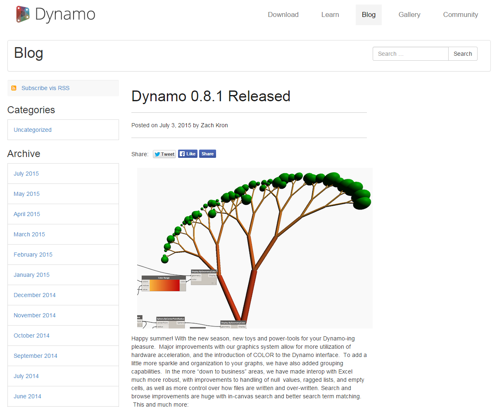

## The Revit Connection    Revit连接

Dynamo for Revit extends building information modeling with the data and logic environment of a graphical algorithm editor.  Its flexibility, coupled with a robust Revit database, offers a new perspective for BIM.

发电机Revit延伸建筑信息建模和图形算法的数据和逻辑环境编辑器。其灵活性,加上一个健壮的Revit数据库,为女子提供了一个新的视角。
 
 

This chapter focuses on the Dynamo workflows for BIM. Sections are primarily exercise-based, since jumping right into a project is the best way to get familiar with a graphical algorithmm editor for BIM.  But first, let's talk about the beginnings of the program.

本章着重于发电机为BIM工作流。部分主要是伴,因为跳跃到一个项目的最佳方法是熟悉一个图形为BIM algorithmm编辑器。但是,首先,让我们讨论程序的开端。

####History of Dynamo   发电机的历史
 
> With a dedicated team of developers and a passionate community, the project has come a long way from its humble beginnings.

>专用的开发团队和一个热情的社区,该项目从其卑微已经走了很长的路。

Dynamo was originally created to streamline AEC workflows in Revit.  While Revit creates a robust database for every project, it can be difficult for an average user to access this information outside of the constraints of the interface.  Revit hosts a comprehensive API (Application Program Interface), allowing third-party developers to create custom tools.  And programmers have been using this API for years, but text-based scripting isn't accessible to everyone. Dynamo seeks to democratize Revit data through an approachable graphical algorithm editor.

发电机是最初创建精简原子能委员会在Revit工作流。虽然Revit为每个项目创建一个健壮的数据库,很难平均用户访问接口的限制以外的信息。Revit主机一个全面的API(应用程序接口),允许第三方开发者创建自定义工具。和程序员多年来一直使用这个API,但是基于文本的不是每个人都可以访问的脚本。发电机寻求民主化Revit数据通过一个平易近人的图形算法编辑器。

Using the core Dynamo nodes in tandem with custom Revit ones, a user can substantially expand parametric workflows for interoperability, documentation, analysis, and generation. With Dynamo, tedious workflows can be automated while design explorations can thrive.

使用核心发电机节点与定制Revit,用户可以大大扩大参数工作流互操作性、文档、分析和生成。与发电机、乏味的工作流可以自动化而设计探索可以茁壮成长。

### Running Dynamo in Revit        在Revit运行发电机  

>1. In a Revit projector family editor, navigate to Addins and click *Dynamo*. Take note: Dynamo will run only in the file in which it was opened.

> 1。Revit投影仪的家庭在一个编辑器,导航到外接程序,然后单击“发电机”。注意:发电机将只运行的文件被打开了。
> 

>1. When openinig Dynamo in Revit, there is a new category called *"Revit"*.  This is a comprehensive addition to the UI which offers nodes specifically catering to Revit workflows.*

> 1。在Revit openinig发电机时,有一个新的类别叫* *“Revit”。这是一个综合的UI提供专门迎合Revit工作流节点。*

**Note - By using the Revit-specific family of nodes, the Dynamo graph will only  work when opening in Dynamo for Revit.  If a Dynamo for Revit graph is opened in Dynamo Sandbox for example, the Revit nodes will be missing.*

**注意:通过使用Revit-specific家庭的节点,发电机图只会开立Revit在发电机工作。如果一个发电机Revit图是在发电机沙箱例如,Revit节点将失踪。*

### Freezing Nodes    冻结的节点
Since Revit is a platform which provides robust project management, parametric operations in Dynamo can be complex and slow to calculate. If Dynamo is taking a long time to calculate nodes, you may want to use the "freeze" node functionality in order to pause the execution of Revit operations while you develop your graph. For more information on freezing nodes, check out the "Freezing" section in the [solids chapter](../05_Geometry-for-Computational-Design/5-6_solids.md#freezing).

### Community
Since Dynamo was originally created for AEC, its large and growing community is a great resource for learning from and connecting with experts in the industry.  Dynamo’s community is made of architects, engineers, programmers, and designers who all have a passion for sharing and making.

Dynamo is an open-source project that is constantly evolving, and a lot of development is Revit-related.  If you're new to the game, get on the discussion forum and start [posting questions](http://dynamobim.org/forums/forum/dyn/)!  If you're a programmer and want to get involved in Dynamo's development, check out the [github page.](https://github.com/DynamoDS/Dynamo).  Also, a great resource for third-party libraries is the [Dynamo package manager](http://dynamopackages.com/). Many of these packagese are made with AEC in mind, and we'll take a look at third-party packages for panelization in this chapter.

> Dynamo also maintains an active [blog](http://dynamobim.com/blog/).  Read up on recent posts to learn about the latest developments!

